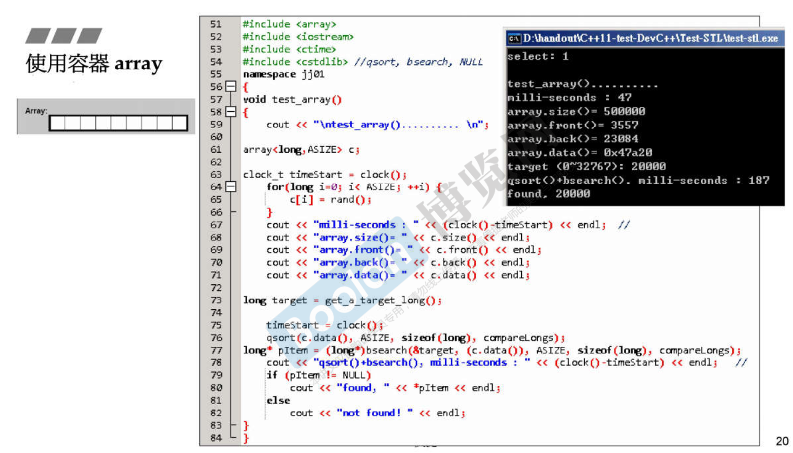

# 1. 认识headers，版本，重要资源

* C++的标准库的header files不带.h。例如： `#include<vector>`
* 新式C header files 不带有附件名。例如 `#include<cstdio>`

常用的两个网站：
1. http://cplusplus.com/
2. https://en.cppreference.com/w/
3. https://gcc.gnu.org/

STL有6大部件。
* 容器   (Containers)
* 分配器 (Allocator)
* 算法   (Algorithms)
* 迭代器 (Iterators)
* 适配器 (Container Adapters)
* 仿函数  (Functor Adapters)

> 前闭后开 区间 [ )

# 2. 测试容器
## 2.1 array

