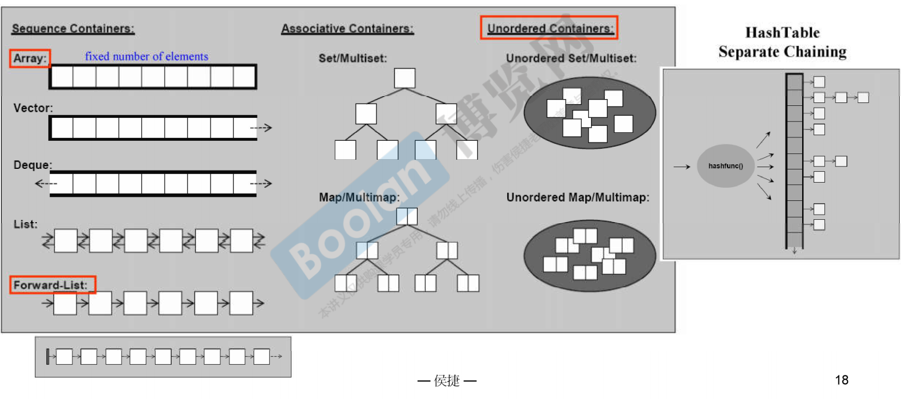
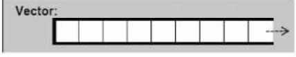
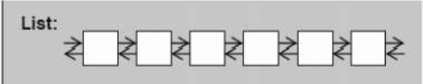

# 1. 认识headers，版本，重要资源

* C++的标准库的header files不带.h。例如： `#include<vector>`
* 新式C header files 不带有附件名。例如 `#include<cstdio>`

常用的两个网站：
1. http://cplusplus.com/
2. https://en.cppreference.com/w/
3. https://gcc.gnu.org/

STL有6大部件。
* 容器   (Containers)
* 分配器 (Allocator)
* 算法   (Algorithms)
* 迭代器 (Iterators)
* 适配器 (Container Adapters)
* 仿函数  (Functor Adapters)


> 前闭后开 区间 [ )
> 


对于 Array 而言，申请创建的时候就必须确定占用内存的大小；
对于 Vector 而言，可以在尾部进行扩张，但是删除元素的时候，由于其内存分布为连续的，因此必须将后的数据都拷贝移动一遍。
对于Deque是可以在首和尾部都进行扩张，连续内存。
对于List是双向链表。
对于Forward-List是首部确定的单向链表



# 2. 测试容器
## 2.1. array
1. 注意 array 只能使用确定的大小，需要在申请 array空间的时候就提供


```cpp
#include <vector>
#include <algorithm>
#include <functional>
#include <iostream>
#include <array>
using namespace std;

long get_a_target_long()
{
    long target=0;
    cout<<"taget (0~"<<RAND_MAX<<");";
    cin>>target;
    return target;
}

string get_a_target_string()
{
    long target=0;
    char buf[10];
    cout<<"target (0~"<<RAND_MAX<<"):";
    cin>>target;
    snprintf(buf,10,"%d",target);   //将long型转化为 字符串
    return string(buf);
}

int compareLongs(const void* a,const void* b)
{
    return (*(long*)a - *(long*)b);
}

int compareStrings(const void* a,const void* b)
{
    if (*(string*)a > *(string*)b)
        return 1;
    else if (*(string*)a < *(string*)b)
        return -1;
    else
        return 0;
}

int main(int argc, char** argv){
    const  int ASIZE=500000;
    cout<<"\ntest_array()....... \n";
    array<long,ASIZE> c{};

    clock_t timeStart = clock();
    for(long i=0;i<ASIZE;i++){
        c[i] = rand();
    }

    qsort(c.data(),ASIZE,sizeof(long),compareLongs);
    cout<< "milli-seconds: "<<(clock()-timeStart)<<endl;
    cout<<"array.size()= "<<c.size()<<endl;
    cout<<"array.front()= "<<c.front()<<endl;   //第一个
    cout<<"array.back()= "<<c.back()<<endl; //最后一个
    cout<<"array.data()= "<<c.data()<<endl; //返回这个数组在内存里面的起点 地址

    long target = get_a_target_long();
    timeStart = clock();    //毫秒
    qsort(c.data(),ASIZE,sizeof(long),compareLongs);    //快排,
    long* PItem = (long*)bsearch(&target,(c.data()),ASIZE,sizeof(long),compareLongs);   //二分查找法 必须是有序的
    cout<<"qsort() + bsearch(),milli-seconds: "<< (clock()-timeStart)<<endl;
    if(PItem != NULL)
        cout<<"found, "<< *PItem<<endl;
    else
        cout<<"not found! "<<endl;
}
```
## 2.2. vector
1. vector只能向后扩展，因此只有 push_back，并且是连续的内存。
2. vecotr的空间增长不是线性的，大多是是 两倍增长。
3. vector有时候不能在原地成长两倍，必须在内存空间中找个一个合适的位置，然后整体搬迁过去，



```cpp
#include <vector>
#include <algorithm>
#include <functional>
#include <iostream>
#include <array>
using namespace std;

long get_a_target_long()
{
    long target=0;
    cout<<"taget (0~"<<RAND_MAX<<");";
    cin>>target;
    return target;
}

int compareLongs(const void* a,const void* b)
{
    return (*(long*)a - *(long*)b);
}

int compareStrings(const void* a,const void* b)
{
    if (*(string*)a > *(string*)b)
        return 1;
    else if (*(string*)a < *(string*)b)
        return -1;
    else
        return 0;
}

namespace jjo2{
    void test(long &value){
        cout<<"\ntest_vector().......\n";
        vector<string> c;
        char buf[10];
        auto timeStart  =clock();
        for(long i =0;i<value;++i)
        {
            try{
                snprintf(buf,10,"%d",rand());
                c.push_back(string(buf));
            }
            catch (exception& p) {
                cout<<"i="<<i<<" "<<p.what()<<endl; //避免内存不够用的情形，会出现 std:: bad_alloc 异常
                abort();    //退出程序
            }
        }
        cout<< "milli-seconds: "<<(clock()-timeStart)<<endl;
        cout<<"vector.size()= "<<c.size()<<endl;    //真正元素的个数
        cout<<"vector.front()= "<<c.front()<<endl;   //第一个
        cout<<"vector.back()= "<<c.back()<<endl; //最后一个
        cout<<"vector.data()= "<<c.data()<<endl; //返回这个数组在内存里面的起点 地址
        cout<<"vector.capacity= "<<c.capacity()<<endl;  //空间的大小
    }
}

int main(int argc, char** argv){
    long a = 50000;
    jjo2::test(a);
}
```

## 2.3. list
1. List可以双向扩张，不是连续的内存空间，双向链表
2. List不需要连续内存



```cpp
#include <vector>
#include <algorithm>
#include <functional>
#include <iostream>
#include <array>
#include <list>
#include <typeinfo>

using namespace std;

long get_a_target_long()
{
    long target=0;
    cout<<"taget (0~"<<RAND_MAX<<");";
    cin>>target;
    return target;
}

string get_a_target_string()
{
    long target=0;
    char buf[10];
    cout<<"target (0~"<<RAND_MAX<<")";
    cin>>target;
    snprintf(buf,10,"%d",target);
    return string (buf);
}

int compareLongs(const void* a,const void* b)
{
    return (*(long*)a - *(long*)b);
}

int compareStrings(const void* a,const void* b)
{
    if (*(string*)a > *(string*)b)
        return 1;
    else if (*(string*)a < *(string*)b)
        return -1;
    else
        return 0;
}

namespace jj03{
    void test(long & value){
        cout<<"\n test_list() ... ... \n";
        list<string> c;
        char buf[10];
        clock_t timeStart = clock();
        for(long i=0;i<value;i++){
            try {
                snprintf(buf,10,"%d",rand());
                c.push_back(buf);
            }
            catch (exception& p) {
                cout<<"i="<<i<<" "<<p.what()<<endl;
                abort();
            }
        }
        cout<< "milli-seconds: "<<(clock()-timeStart)<<endl;
        cout<<"list.size()= "<<c.size()<<endl;    //元素的个数
        cout<<"list.max_size()= "<<c.max_size()<<endl;  //最大放置的元素个数
        cout<<"list.front()= "<<c.front()<<endl;   //第一个
        cout<<"list.back()= "<<c.back()<<endl; //最后一个

        string target = get_a_target_string();
        timeStart = clock();
//        _List_iterator<basic_string<char>> PItem = ::find(c.begin(), c.end(), target);
        auto PItem = ::find(c.begin(), c.end(), target);

        cout<<"::find(), milli-seconds : "<<(clock()-timeStart)<<endl;
        cout<<typeid(PItem).name()<<endl;
        if(PItem != c.end())
            cout<<"found, "<<*PItem<<endl;
        else
            cout<<"not found!"<<endl;
        timeStart = clock();
        c.sort();   //标准库有一个sort,容器本身也有一个 sort; 用容器自己的sort更好
        cout<<"c.sort(), milli-seconds: "<<(clock()-timeStart)<<endl;
    }
}

int main(int argc, char** argv){
    long a = 1000000;
    jj03::test(a);
}
```
## 2.4. forward——list
1. 单向链表，只提供 push_front
2.  


```cpp
#include <vector>
#include <algorithm>
#include <functional>
#include <iostream>
#include <array>
#include <list>
#include <typeinfo>
#include <forward_list>

using namespace std;

long get_a_target_long()
{
    long target=0;
    cout<<"taget (0~"<<RAND_MAX<<");";
    cin>>target;
    return target;
}

string get_a_target_string()
{
    long target=0;
    char buf[10];
    cout<<"target (0~"<<RAND_MAX<<")";
    cin>>target;
    snprintf(buf,10,"%d",target);
    return string (buf);
}

int compareLongs(const void* a,const void* b)
{
    return (*(long*)a - *(long*)b);
}

int compareStrings(const void* a,const void* b)
{
    if (*(string*)a > *(string*)b)
        return 1;
    else if (*(string*)a < *(string*)b)
        return -1;
    else
        return 0;
}

namespace jj04{
    void test(long & value){
        cout<<"\n test_list() ... ... \n";
        forward_list<string> c;
        char buf[10];
        clock_t timeStart = clock();
        for(long i=0;i<value;i++){
            try {
                snprintf(buf,10,"%d",rand());
                c.push_front(buf);
            }
            catch (exception& p) {
                cout<<"i="<<i<<" "<<p.what()<<endl;
                abort();
            }
        }
        cout<< "milli-seconds: "<<(clock()-timeStart)<<endl;
        cout<<"list.max_size()= "<<c.max_size()<<endl;  //最大放置的元素个数
        cout<<"list.front()= "<<c.front()<<endl;   //第一个

        string target = get_a_target_string();
        timeStart = clock();
//        _List_iterator<basic_string<char>> PItem = ::find(c.begin(), c.end(), target);
        auto PItem = ::find(c.begin(), c.end(), target);

        cout<<"::find(), milli-seconds : "<<(clock()-timeStart)<<endl;
        cout<<typeid(PItem).name()<<endl;
        if(PItem != c.end())
            cout<<"found, "<<*PItem<<endl;
        else
            cout<<"not found!"<<endl;
        timeStart = clock();
        c.sort();   //标准库有一个sort,容器本身也有一个 sort; 用容器自己的sort更好
        cout<<"c.sort(), milli-seconds: "<<(clock()-timeStart)<<endl;
    }
}

int main(int argc, char** argv){
    long a = 1000000;
    jj04::test(a);
}
```

## 2.5. deque
1. 一个容器占用内存以后不能在原地扩充，比如 vector需要整体搬迁到其他的位置进行扩张。
2. Deque是分段有序，但是让使用者感觉是 整体有序，每次扩充 一个 Buffer, 


 


## 2.6. stack 和 queue
1. 一个Deque包含了 stack,和queue.因此 Deque 直接被复用了。


## 2.7. multiset
* 底部是 红黑树支持
* 允许重复的 key在内，而对于set而言，必须要求独一无二的key

```cpp
#include <iostream>
#include <set>

using namespace std;

string get_a_target_string()
{
    long target=0;
    char buf[10];
    cout<<"target (0~"<<RAND_MAX<<"): ";
    cin>>target;
    snprintf(buf,10,"%d",target);
    return string (buf);
}

void test_multiset(long& value) {
    cout << "\n test_multiset() ....... \n";
    multiset<string> c;
    char buf[10];
    clock_t timeStart = clock();

    for (long i = 0; i < value; ++i) {
        try {
            snprintf(buf, 10, "%d", rand());
            c.insert(string(buf));
        }
        catch (exception &p) {
            cout << "i= " << i << p.what() << endl;
            abort();
        }
    }
    cout << "milli-seconds: " << (clock() - timeStart) << endl;
    cout << "multiset.size()= " << c.size() << endl;
    cout << "multiset.maxsize()= " << c.max_size() << endl;

    string target = get_a_target_string();
    {
        timeStart = clock();
        auto pItem = c.find(target);
        cout<<"c.find(), milli-seconds: "<<(clock()-timeStart)<<endl;
        if (pItem != c.end())
            cout<<"found, "<<*pItem<<endl;
        else
            cout<<"not found!"<<endl;
    }
}

int main(int argc,char** argv)
{
    long value = 1000000;
    test_multiset(value);
}
```
## 2.8. 容器unordered_multiset
* 使用hash链表，其中 bucket_count()的个数 **一定比** 比元素个数要多，翻倍增加
*  


## 2.9 分配器
```cpp
#include <list>
#include <stdexcept>
#include <string>
#include <cstdlib> 		//abort()
#include <cstdio>  		//snprintf()
//#include <algorithm> 	//find()
#include <iostream>
#include <ctime>

//#include <cstddef>
//#include <memory>	//內含 std::allocator

//欲使用 std::allocator 以外的 allocator, 得自行 #include <ext\...>
#ifdef __GNUC__
#include <array_allocator.h>
#include <mt_allocator.h>
#include <debug_allocator.h>
#include <pool_allocator.h>
#include <bitmap_allocator.h>
#include <malloc_allocator.h>
#include <new_allocator.h>
#endif
using namespace  std;


namespace jj20
{
//pass A object to function template impl()，
//而 A 本身是個 class template, 帶有 type parameter T,
//那麼有無可能在 impl() 中抓出 T, 創建一個 list<T, A<T>> object?
//以下先暫時迴避上述疑問.

    void test_list_with_special_allocator()
    {
#ifdef __GNUC__
        cout << "\ntest_list_with_special_allocator().......... \n";

        //不能在 switch case 中宣告，只好下面這樣. 				//1000000次
        list<string, allocator<string>> c1;						//3140
        list<string, __gnu_cxx::malloc_allocator<string>> c2;  	//3110
        list<string, __gnu_cxx::new_allocator<string>> c3; 		//3156
        list<string, __gnu_cxx::__pool_alloc<string>> c4;  		//4922
        list<string, __gnu_cxx::__mt_alloc<string>> c5; 		//3297
        list<string, __gnu_cxx::bitmap_allocator<string>> c6;  	//4781

        int choice;
        long value;

        cout << "select: "
             << " (1) std::allocator "
             << " (2) malloc_allocator "
             << " (3) new_allocator "
             << " (4) __pool_alloc "
             << " (5) __mt_alloc "
             << " (6) bitmap_allocator ";

        cin >> choice;
        if ( choice != 0 ) {
            cout << "how many elements: ";
            cin >> value;
        }

        char buf[10];
        clock_t timeStart = clock();
        for(long i=0; i< value; ++i)
        {
            try {
                snprintf(buf, 10, "%ld", i);
                switch (choice)
                {
                    case 1 : 	c1.push_back(string(buf));
                        break;
                    case 2 : 	c2.push_back(string(buf));
                        break;
                    case 3 : 	c3.push_back(string(buf));
                        break;
                    case 4 : 	c4.push_back(string(buf));
                        break;
                    case 5 : 	c5.push_back(string(buf));
                        break;
                    case 6 : 	c6.push_back(string(buf));
                        break;
                    default:
                        break;
                }
            }
            catch(exception& p) {
                cout << "i=" << i << " " << p.what() << endl;
                abort();
            }
        }
        cout << "a lot of push_back(), milli-seconds : " << (clock()-timeStart) << endl;


        //test all allocators' allocate() & deallocate();
        int* p;
        allocator<int> alloc1;
        p = alloc1.allocate(1);
        alloc1.deallocate(p,1);

        __gnu_cxx::malloc_allocator<int> alloc2;
        p = alloc2.allocate(1);
        alloc2.deallocate(p,1);

        __gnu_cxx::new_allocator<int> alloc3;
        p = alloc3.allocate(1);
        alloc3.deallocate(p,1);

        __gnu_cxx::__pool_alloc<int> alloc4;
        p = alloc4.allocate(2);
        alloc4.deallocate(p,2); 	//我刻意令參數為 2, 但這有何意義!! 一次要 2 個 ints?

        __gnu_cxx::__mt_alloc<int> alloc5;
        p = alloc5.allocate(1);
        alloc5.deallocate(p,1);

        __gnu_cxx::bitmap_allocator<int> alloc6;
        p = alloc6.allocate(3);
        alloc6.deallocate(p,3);  	//我刻意令參數為 3, 但這有何意義!! 一次要 3 個 ints?
#endif
    }
}

int main(int argc, char** argv){
    jj20::test_list_with_special_allocator();
}
```


# 3. 泛型编程

## 3.1 OOP vs GP
**OOP** - Object-Oriented programming
**GP**  - Generic programming

**OOP** 是将 datas 和 methods 关联在一起，sort就在 list 里面
```cpp
template <class T, class Alloc=alloc>
class list{
    ...
    void sort();
}
```

**GP** 是将 datas 和 methods 分开来， 比如 vector 以及 deque 都没有 sort.``` ::sort(c.begin(),c.end());``` 通过 c.begin()以及c.end()得到两个迭代器指针


采用 **GP** 的好处“
* Containers 以及 Algorithms 团队可以各自工作， 以 **Iterator** 来进行沟通


```cpp
template<class T>
inline const T& min(const T& a, const T &b){
    return b < a ? b:a;
}
```


**OOP** 中 list无法使用 **GP** 形式的 **sort**
```cpp
template <class RnadomAccessIterator>
inline void sort(RandomAccessIterator first, RandomAccessIterator last){
    if(first != last){
        _introsort_loop(first,last,value_type(first))
        _final_insertion_sort(first,last);
    }
}

template <class RnadomAccessIterator,calss T, class Size>
void __introsort_loop(RandomAccessIterator first, RandomAccessIterator last,
                        T*,Size depth_limit){
...
RandomAccessIterator cut = __unguarded_partition
    (first,last,T(__median(*fisrt,*(first+(last-first)/2), *(last-1))));
                        }
只有随机访问迭代器RandomAccessIterator才能使用这中 sort
但是链表在内存里面不是连续的内存，是采用指针的形式串联起来的。无法采用 *(first+(last-first)/2)的这种形式
```

## 3.2 操作符重载以及模板 P10


