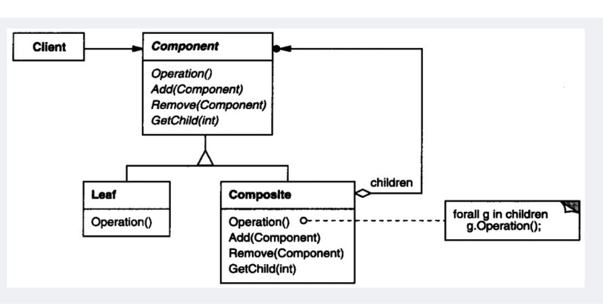
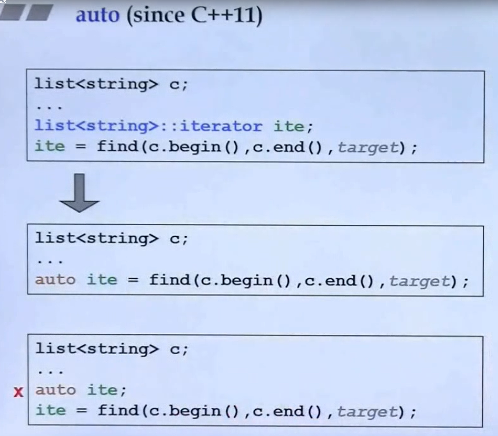
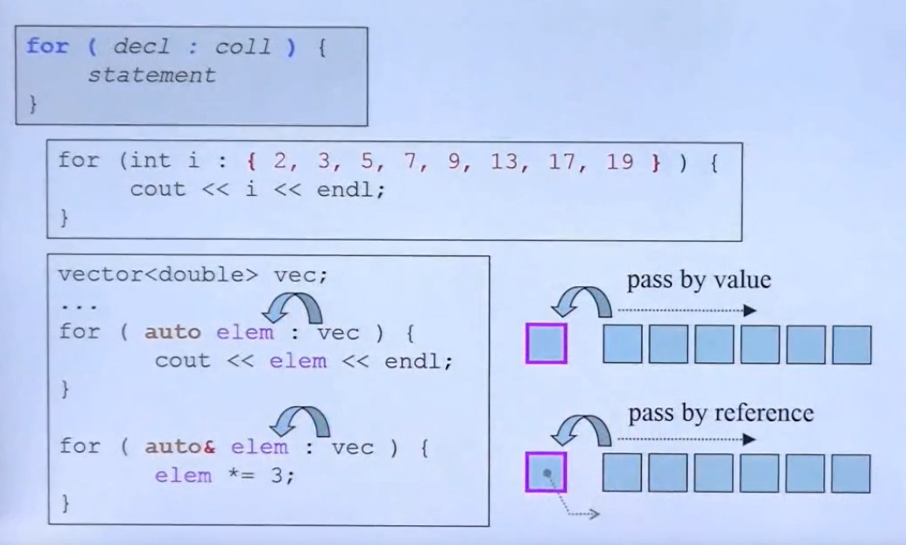
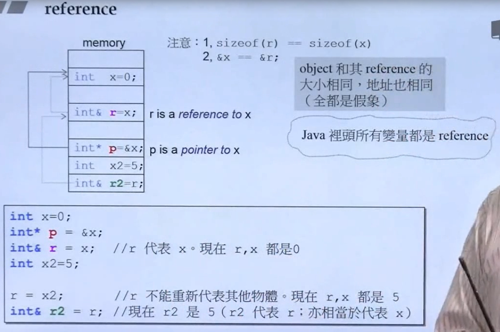
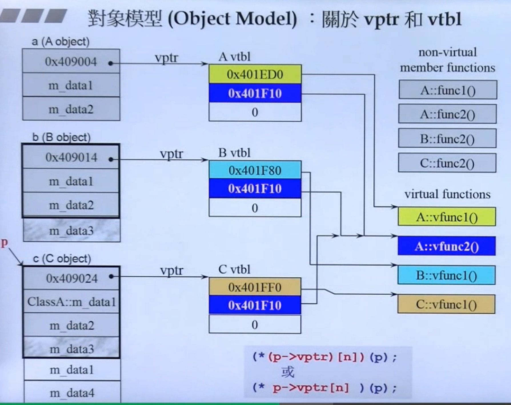
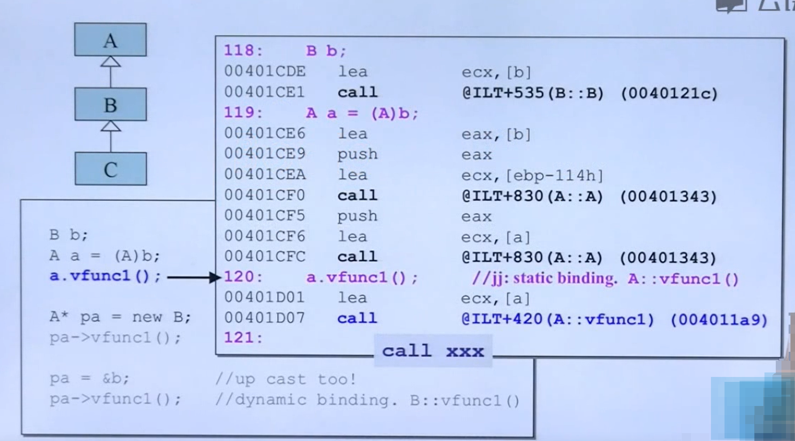
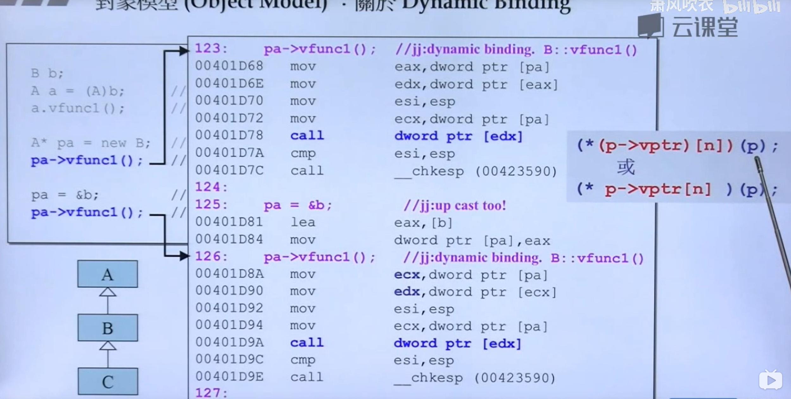

# 1. c++面向对象高级开发
## 1.1 complex
```c++
main.cpp
#include <iostream>
#include "complex.h"
using namespace std;

int main(int argc,char** argv){
    complex a(1,2);
    cout<<a;
    complex b = a+4;
    cout<<b;
    cout<<a+b;
}
```

```c++
complex.h
#ifndef TESTCPP_COMPLEX_H
#define TESTCPP_COMPLEX_H
#include <iostream>
using std::endl,std::ostream,std::cout;

class complex {
public:
    explicit complex(double r=0.,double i=0.):re(r),im(i){}
    complex& operator += (const complex& );
    double real() const {return re;};
    double imag () const{return im;};

private:
    double re,im;
    friend complex& __doapl (complex*,const complex&);

};


inline complex&
complex::operator += (const complex& r){
    return __doapl(this,r);
}

complex & __doapl(complex * ths, const complex & r) {
    ths->re += r.re;
    ths->im += r.im;
    return *ths;
}

inline complex
operator + (const complex &x, const complex & y){
    return complex(x.real() + y.real(),
                   x.imag()+y.imag());
}

inline complex
operator + (double x, const complex & y){
    return complex(x + y.real(),
                   y.imag());
}

inline complex
operator + (const complex &x, double y){
    return complex(x.real() + y,
                   x.imag());
}

inline ostream&
operator << (ostream& os,const complex &x){
    return os<<'('<<x.real()<<','<<x.imag()<<')'<<endl;
}
#endif //TESTCPP_COMPLEX_H

```

## 1.2 string
```cpp
//
// Created by wf on 2020/8/18 0018.
//

#ifndef TESTCPP_STRING_H
#define TESTCPP_STRING_H
#include <iostream>
#include <string.h>


class String {
public:
    explicit String(const char* cstr=nullptr);
    String(const String& str);  //拷贝构造函数
    String& operator=(const String& str);   //拷贝赋值
    ~String();
//    char* get_c_str() const {return m_data;}

private:
    char* m_data;
};

inline
String::String(const char *cstr) {
    if (cstr){
        m_data = new char [strlen(cstr) + 1];
        strcpy(m_data,cstr);
    }
    else{
        m_data = new char [1];
        *m_data = '\0';
    }
}

String::~String() {
    std::cout<<*m_data<<"析构了"<<std::endl;
    delete [] m_data;
}

inline
String::String(const String &str) {
    m_data = new char [strlen(str.m_data) + 1];
    strcpy(m_data,str.m_data);
}

String &String::operator=(const String &str) {
    if (this == &str)
        return *this;
    delete [] m_data;
    m_data = new char [strlen(str.m_data) +1];
    strcpy(m_data,str.m_data);
    return *this;
}
#endif //TESTCPP_STRING_H


```

```

#include <iostream>
#include "String.h"

using std::cout;
using std::endl;

int main(int argc,char** argv) {
    String s1();
    String s2("w");

    String *p = new String("x");
    delete p;

    String *p = new String[3];
    delete p[]; //这里注意要用 p[]，这样才能调用多次析构函数，去析构动态内存区域


//    String s3(s1);
//    cout<<s3<<endl;
//    s3=s2;
//    cout<<s3<<endl;

}
```

## 1.3 单例模式
```c++
class Single{
public:
    static Single & getInstance ( ){return a;}
private:
    A();
    A(const A& rhs);
    static A a;
}
```
上面可能出现 a没有被使用，但是仍然存在。
更好的形式，

```c++
class A{
public:
    static A& getInstance();
private:
    A();
    A(const A& rhs);
};

A &A::getInstance() {
    static A a;
    return a;
}

```

## 1.4 面向对象编程 Object Oriented programming
* Inheritance 继承 --> is-a
* Composition 复合 --> has-a
* Delegation  委托 --> Composition by reference

### 1.4.1 继承和虚函数的结合
```c++
class CDocument{
public:
    void OnFileOpen(){
        //这是个算法，每个cout代表一个操作
        cout<<"dialog..."<<endl;
        cout<<"check file status..."<<endl;
        cout<<"open file.."<<endl;
        Serialize();
        cout<<"close file..."<<endl;
        cout<<"update all views..."<<endl;
    }
    virtual void Serialize(){cout<<"执行的是CDocument..."<<endl;};
};

class CMYDoc: public CDocument{
public:
    //只有应用程序本身才知道如何读数据的方式
    virtual void Serialize(){
        cout<<"执行的是 CMYDoc..."<<endl;
    }
};

int main(int argc,char** argv) {
    CMYDoc myDoc;
    myDoc.OnFileOpen();
}


dialog
check file status
open file
执行的是 CMYDoc
close file...
update all views...

Process finished with exit code 0

```

### 1.4.2 委托和继承 Composite模式




```cpp
composite
//
// Created by wf on 2020/8/21 0021.
//

#ifndef TESTCPP_COMPOSITE_H
#define TESTCPP_COMPOSITE_H
#include <vector>
#include <iostream>
using namespace std;
/*
Component抽象基类，为组合中的对象声明接口,声明了类共有接口的缺省行为(如这里的Add,Remove,GetChild函数),
声明一个接口函数可以访问Component的子组件.
*/
class Component
{
public:
    //纯虚函数，只提供接口，没有默认的实现
    virtual void Operation()=0;

    // 虚函数,提供接口,有默认的实现就是什么都不做
    virtual void Add(Component*) {cout << "add" << endl;}
    virtual void Remove(Component*) {}
    virtual Component* GetChild(int index) {return nullptr;}
    virtual ~Component()=default;
protected:
    Component()=default;
};

//Leaf是叶子结点,也就是不含有子组件的结点类，所以不用实现Add、Remove、GetChild等方法
class Leaf: public Component{
public:
    //只实现Operation接口
    virtual void Operation();
    Leaf()=default;
    ~Leaf()=default;
};

void Leaf::Operation() {
    cout<< "Leaf::Operation" <<endl;
}


//Composite：含有子组件的类
class Composite:public Component{
public:
    //实现所有接口
    Composite()=default;
    ~Composite()=default;
    //实现所有接口
    void Operation() override;
    void Add(Component*) override;
    void Remove(Component*) override;
    Component* GetChild(int index) override;

private:
    //这里采用vector来保存子组件
    vector<Component*> m_ComVec;

};

void Composite::Add(Component * com) {
    this->m_ComVec.push_back(com);
}

void Composite::Remove(Component *com) {
//    this->m_ComVec.erase(&com);
}
void Composite::Operation() {
    cout << "Composite::Operation" << endl;
    vector<Component*>::iterator iter = this->m_ComVec.begin();
    for(;iter!= this->m_ComVec.end();iter++)
    {
        (*iter)->Operation();
    }
}
Component* Composite::GetChild(int index)
{
    if(index < 0 || index > this->m_ComVec.size())
    {
        return nullptr;
    }
    return this->m_ComVec[index];
}

#endif //TESTCPP_COMPOSITE_H

```

```cpp
main
#include <iostream>
#include "composite.h"


using std::cout;
using std::endl;


int main(int argc,char** argv) {
    /*
      不管是叶子Leaf还是Composite对象pRoot、pCom都实现了Operation接口，所以可以一致对待，直接调用Operation()
      体现了“使得用户对单个对象和组合对象的使用具有一致性。”
    */
    Composite* pRoot = new Composite();
    //组合对象添加叶子节点
    pRoot->Add(new Leaf());
    Leaf* pLeaf1 = new Leaf();
    Leaf* pLeaf2 = new Leaf();
    //这里的叶子再添加叶子是没有意义的。
    //由于叶子与组合对象继承了相同的接口，所以语法上是对的，实际上什么也没做(继承自基类Component的Add方法)。
    //叶子节点只实现了Operation方法，其他Add、Remove、GetChild都继承自基类，没有实际意义。
    pLeaf1->Add(pLeaf2);
    pLeaf1->Remove(pLeaf2);
    //执行叶子Operation操作
    pLeaf1->Operation();
    //组合对象实现了基类Component的所有接口，所以可以做各种操作(Add、Remove、GetChild、Operation)。
    Composite* pCom = new Composite();
    //组合对象添加叶子节点
    pCom->Add(pLeaf1);
    //组合对象添加叶子节点
    pCom->Add(pLeaf2);
    //执行组合对象Operation操作
    pCom->Operation();

    //组合对象添加组合对象
    pRoot->Add(pCom);

    //执行组合对象Operation操作
    pRoot->Operation();

    Component* cp = pCom->GetChild(0);
    cp->Operation();

    pCom->Remove(pLeaf1);

    return 0;

}
```


### 1.4.3 原型模式 (Prototype)
有一个系统中有很多系统配置和用户简况：

1. 初始读取配置或用户简况需要花一些时间（比如用一些系统调用或读取数据库等），但并非实时数据，只需初始化读一遍;
2. 因为众多系统配置和用户简况需要初始化，每次手动初始化比较繁琐，希望能一个类其中管理并快速创建实例
那么如何能不每次手动初始化对象，并能克隆初始化的数据到新的实例呢？

使用一个原型的实例来创建一些特定的对象，然后当创建这些新的对象时通过拷贝这个原型。


使用原型模式：

1. 第一次花一段时间初始化系统配置和用户简况的数据，存入相应的变量内;
2. 原型管理类其中管理需要克隆的类，直接克隆初始化好的实例的数据变量值，不再需要去或系统调用或读取来初始化数据。
3. 客户直接使用原型管理类获取实例，不再需要手动实例化它们。

## 1.5 conversion function
```cpp
#include <iostream>
#include <vector>
using namespace std;

class Fraction
{
public:
    Fraction(int num,int den=1):m_numerator(num),m_denominator(den){}
    operator double () const{ //如果这里用了 explicit 那么不能运行 d=4+f，无法隐式转化过去
//        return (double)(m_numerator) / (double) m_denominator;
        return (double )(m_numerator/m_denominator);
    }

private:
    int m_numerator;
    int m_denominator;
};


int main(int argc,char** argv) {
    Fraction f(3,5);
    double d=4+f;
    cout<<d<<endl;

}
```


## 1.6  non-explicit one argument constructor

```cpp
这里如果   operator double () const 和 Fraction operator+ 会产生歧义的错误，ambiguous overload for ‘operator+’ 。系统不知道是 都转为分数计算，还是都为浮点数计算。
#include <iostream>
#include <vector>
using namespace std;

class Fraction
{
public:
    Fraction(int num,int den=1):m_numerator(num),m_denominator(den){}
    operator double () const{ //如果这里用了 explicit 那么不能运行 d=4+f，无法隐式转化过去
//        return (double)(m_numerator) / (double) m_denominator;
        return (double )(m_numerator/m_denominator);
    }

    Fraction operator+(const Fraction& m){
        return Fraction(this->m_numerator+m.m_numerator,this->m_denominator);
    }

    /*
    ostream&
    operator << (ostream& os){
        return os<<"分子： "<<this->m_numerator<<"分母: "<<this->m_denominator<<endl;
    } //如果写在里面，由于this指针的问题，会写成 d2<<cout;
    */

    int get_numerator () const {return m_numerator;}
    int get_denominartor() const {return m_denominator;}

private:
    int m_numerator;
    int m_denominator;
};

inline ostream&
operator << (ostream &os, const Fraction &x){
    return os<<"分子： "<<x.get_numerator()<<" 分母: "<<x.get_denominartor()<<endl;
}


int main(int argc,char** argv) {
    Fraction f(3,5);


    int x=4;
    Fraction d2=f+x;
    cout<<d2<<endl;


}
```

```cpp

明确的调用 explict，那么这个只为构造函数，并不会隐式的将 分数转为浮点数，或将整数转为分数。
#include <iostream>
#include <vector>
using namespace std;

class Fraction
{
public:
    explicit Fraction(int num,int den=1):m_numerator(num),m_denominator(den){}
    operator double () const{ //如果这里用了 explicit 那么不能运行 d=4+f，无法隐式转化过去
//        return (double)(m_numerator) / (double) m_denominator;
        return (double )(m_numerator/m_denominator);
    }

    Fraction operator+(const Fraction& m){
        return Fraction(this->m_numerator+m.m_numerator,this->m_denominator);
    }

    /*
    ostream&
    operator << (ostream& os){
        return os<<"分子： "<<this->m_numerator<<"分母: "<<this->m_denominator<<endl;
    } //如果写在里面，由于this指针的问题，会写成 d2<<cout;
    */

    int get_numerator () const {return m_numerator;}
    int get_denominartor() const {return m_denominator;}

private:
    int m_numerator;
    int m_denominator;
};

inline ostream&
operator << (ostream &os, const Fraction &x){
    return os<<"分子： "<<x.get_numerator()<<" 分母: "<<x.get_denominartor()<<endl;
}


int main(int argc,char** argv) {
    Fraction f(3,5);
    double s = double(f)+0.3;
    cout<<s<<endl;

    int x=4;
    Fraction d2=f+fraction(x);
    cout<<d2<<endl;


}
```

## 1.7 pointer-like class 智能指针

```cpp
#include <iostream>
#include <vector>
using namespace std;

struct Foo
{
    void method(void){  }
};

template <class T>
class shared_ptr{
public:
    T & operator*() const{
        return *px;
    }

    T* operator->() const{
        return px;
    }

    shared_ptr(T *p): px(p){}   //构造函数，传入的参数是一个，类型为T的p指针。

private:
    T* px;
    long* pn;
};

int main(int argc,char** argv) {

shared_ptr<Foo> sp(new Foo); //指定类型为 Foo, 指针 *p = new Foo, 并且将 p利用初始化列表赋值给 px,
//意味着 sp 类型为 shared_ptr, 里面有属性 px 指针

Foo f(*sp); // *sp 返回的是 *px 即 *p = new Foo.

sp->method();   //由于 ->具有无限调用的属性， 第一步：px->method() 
}
```

### 迭代器
```cpp

#include <iostream>
#include <vector>
using namespace std;

template <class T>
struct __list_node{
    void * prev;
    void* next;
    T data;
};

//链表
template <class T,class Ref, class Ptr>
struct __list_iterator{
    typedef __list_iterator<T,Ref,Ptr> self;
    typedef Ptr pointer;
    typedef Ref reference;
    typedef __list_node<T>* link_type;
    link_type node;
    bool operator==(const self&x) const{return node==x.node;}
    bool operator!=(const self&x) const{return node != x.node;}
    reference operator*() const {return (*node).data;}
    pointer operator->() const {return &(operator*());}
    self& operator++() {node= (link_type)((*node).next); return *this;}
    self operator++(int) {self tmp=*this;++*this;return tmp;}
    self& operator--()  {node = (link_type)((*node).prev);return *this; }
    self operator--(int)    {self tmp=*this;--*this; return tmp;}

};

struct Foo
{
    void method(void){  cout<<"Foo call 'method' "<<endl;}
};

typedef __list_iterator<Foo,Foo,Foo*> list;

int main(int argc,char** argv) {
    list it;
    it->method();
}

```


## 1.8 函数模板
```cpp
#include <iostream>
#include <vector>
using std::cout,std::endl;

template <class T>
inline
const T& min(const T& a,const T& b)
{
    return b<a? b:a;
}


class stone{
public:
    stone()=default;
    stone(int w,int h,int we=0):_w(w),_h(h),_weight(we){}
    bool operator< (const stone& rhs) const
    {return _weight<rhs._weight;}

private:
    int _w,_h,_weight;
};

int main(int argc,char** argv) {
    stone r1(2,3),r2(3,3),r3;
    r3 = min(r1,r2);
    return 0;
}
```


## 1.9 模板特化
```cpp
#include <iostream>
#include <vector>
using std::cout,std::endl;

//泛化
template <class Key>
struct hash{};

//特化
template <>
struct hash<char>{
    size_t operator()(char x) const {return x;}
};

template <>
struct hash<int>{
    size_t operator()(int x) const {return x;}
};

template <>
struct hash<long>{
    size_t operator()(long x) const {return x;}
};

int main(int argc,char** argv) {
    cout<< hash<long>()(1000);
}
```
## 2.0 C++11
### 2.0.1 variadic templates (since C++11) 数量不定的模板参数
```cpp
#include <iostream>
#include <vector>
#include <bitset>
using std::bitset;
using std::cout,std::endl;

void print()
{}  //最后变成0个参数输入的时候，调用这个 无参函数 print(),

// 数量不定的模板参数，
template <typename T,typename... Types>
void print(const T& firstArg, const Types&... args)
{
    cout<<firstArg<<endl;
    cout<<sizeof...(args)<<endl;    //输出 args的 pack个数
    print(args...); //使用 递归的形式，输出 firstArg.
}


int main(int argc,char** argv) {

    print(7.5,"hello",bitset<16>(377),42);
//    7.5
//    hello
//    0000000101111001
//    42


//    7.5
//    3
//    hello
//    2
//    0000000101111001
//    1
//    42
//    0
}
```

### 2.0.2 auto


### 2.0.3 ranged-base for


## 2.1  Reference


```cpp
int main(int argc,char** argv) {
    int x=1;
    int* p = &x;    // p指针存放的是 x的地址，
    cout<<sizeof(p)<<endl;  //8个字节，64位的电脑
    cout<<*p<<endl; // 1
    int & r = x;    // r代表x, r is reference to x
    int x2=5;

    r=x2;
    cout<<r<<" "<<x<<endl; // 5  5
    int& r2 = r;    //现在 r2是5，r2 代表 r以及x
    r2 = 10;
    cout<<r<<r2<<x<<endl;   //10 10 10

}
```

```cpp
#include <iostream>
#include <vector>
#include <bitset>
using std::bitset;
using std::cout,std::endl;

typedef struct Stag {int a,b,c,d;} S;
int main(int argc,char** argv) {
    double x=0;
    double *p = &x;
    double & r = x;

    cout<<sizeof(x)<<endl;  //8
    cout<<sizeof(p)<<endl;  //8
    cout<<sizeof(r)<<endl;  //8 这个是假象，实际上给r是一个指针，占据了 8个
    cout<<p<<endl;  // 0x7ffee7cf3550
    cout<<*p<<endl; // 0
    cout<<x<<endl;  // 0
    cout<<r<<endl;  // 0
    cout<<&x<<endl; //  0x7ffee7cf3550
    cout<<&r<<endl; //  0x7ffee7cf3550

    int x2=2;
    int & r2 = x2;
    cout<<sizeof(r2)<<endl; //4 这个是假象，实际上给r是一个指针，占据了 8个


    S s;
    S& rs = s;
    cout<< sizeof(s)<<endl; //16
    cout<< sizeof(rs)<<endl;    //16
    cout<< &s<<endl;    //0x7ffeb9ee7a60
    cout<< &rs <<endl;  //0x7ffeb9ee7a60
}
```

## 2.2 vptr vtbl 虚表和虚指针


```cpp
#include <iostream>
#include <vector>
#include <bitset>
using std::bitset;
using std::cout,std::endl;

class A {
public:
    virtual void vfunc1();
    virtual void vfunc2();
    void func1();
    void func2();

private:
    int m_data1,m_data2;    // 4+4+8
};

class B: public A{
public:
    virtual void vfunc1();
    void func2();

private:
    int m_data3;    // 16+4 对齐后变为 24
};

class C: public B{
public:
    virtual void vfunc1();
    void func2();

private:
    int m_data1,m_data4;    // 24 + 8，如果这里只有一个 int，那么为 24
};


int main(int argc,char** argv) {
    cout<<sizeof(A)<<" "<<sizeof(B)<<" "<<sizeof(C)<<endl;    //16 24 32 虚函数指针占了8个字节
    cout<<sizeof(int)<<endl;

}
```

## 2.3 关于动态绑定 Dynamic Binding


```cpp
#include <iostream>
#include <vector>
#include <bitset>
using std::bitset;
using std::cout,std::endl;
using std::vector;

class A {
public:
    virtual void vfunc1();
    virtual void vfunc2(){}
    void func1(){}
    void func2(){}

private:
    int m_data1,m_data2;    // 4+4+8
};

void A::vfunc1() {
    cout<<"A  vfunc1 "<<endl;
}

class B: public A{
public:
    virtual void vfunc1();
    void func2(){}


private:
    int m_data3;    // 16+4 对齐后变为 24
};

void B::vfunc1() {
    cout<<"B  vfunc1 "<<endl;
}

class C: public B{
public:
    virtual void vfunc1();
    void func2(){}

private:
    int m_data1,m_data4;    // 24 + 8，如果这里只有一个 int，那么为 24
};

void C::vfunc1() {
    cout<<"C  vfunc1 "<<endl;
}


int main(int argc,char** argv) {
    cout<<sizeof(A)<<" "<<sizeof(B)<<" "<<sizeof(C)<<endl;    //16 24 32 虚函数指针占了8个字节
    cout<<sizeof(int)<<endl;

    B b;
    A a = (A) b;
    a.vfunc1();     //  A  vfunc1, 这个是通过 对象调用，静态调用

    A* pa = new B;  //指针，向上转型，虚函数    
    pa->vfunc1();   // B  vfunc1

    pa = &b;
    pa->vfunc1();   // B  vfunc1
}
```



## 2.4 const
```c++
// 成员函数后面放 const，表示 该函数不会改变数据
A::get() const {
}
```

 


