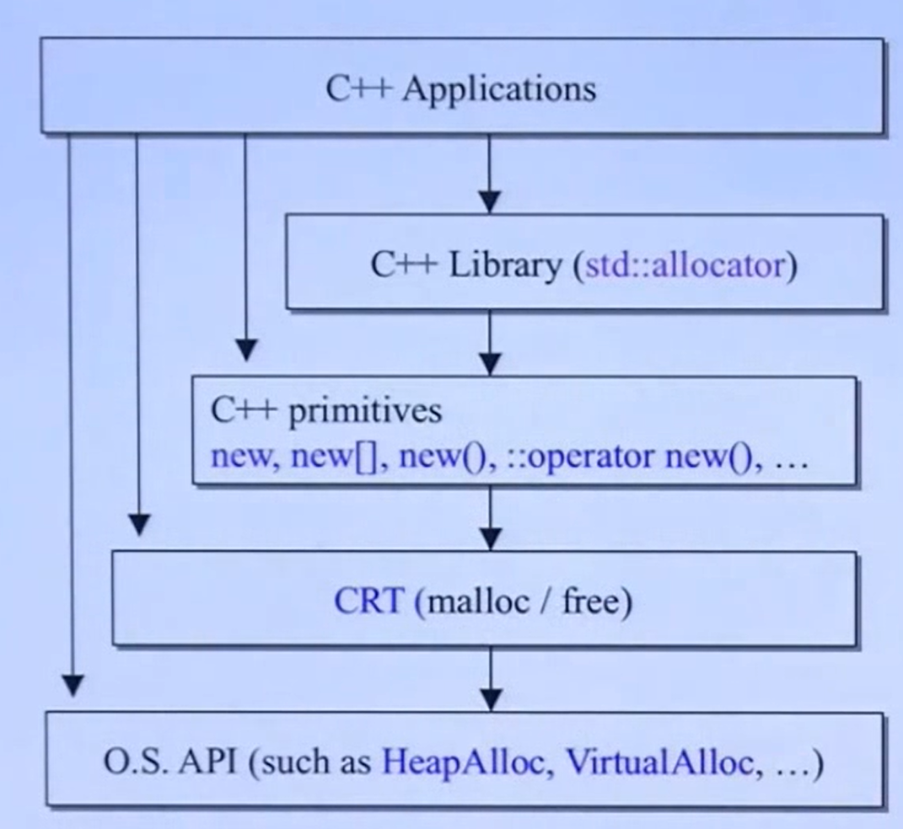
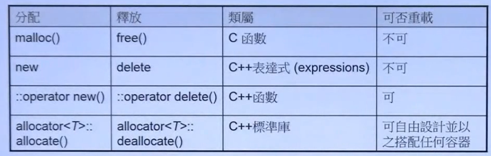

# 1. 内存分配的每一层面





 ```cpp
#include <iostream>
#include <vector>
#include <bitset>
#include <string>

using std::bitset;
using std::cout,std::endl;
using std::vector;
using std::string;
using std::ostream;


template <typename T>
class complex {
public:
    explicit complex(T r=0.,T i=0.):re(r),im(i){}
    complex<T>& operator += (const complex& );
    T real() const {return re;};
    T imag () const{return im;};

private:
    T re,im;
    friend complex<T>& __doapl (complex*,const complex&);

};

template <typename T>
inline complex<T>&
complex<T>::operator += (const complex& r){
    return __doapl(this,r);
}

template <typename T>
complex<T> & __doapl(complex<T> * ths, const complex<T> & r) {
    ths->re += r.re;
    ths->im += r.im;
    return *ths;
}

template <typename T>
inline complex<T>
operator + (const complex<T> &x, const complex<T> & y){
    return complex(x.real() + y.real(),
                   x.imag()+y.imag());
}

template <typename T>
inline complex<T>
operator + (T x, const complex<T> & y){
    return complex(x + y.real(),
                   y.imag());
}

template <typename T>
inline complex<T>
operator + (const complex<T> &x, T y){
    return complex(x.real() + y,
                   x.imag());
}

template <typename T>
inline ostream&
operator << (ostream& os,const complex<T> &x){
    return os<<'('<<x.real()<<','<<x.imag()<<')'<<endl;
}

//以下使用 c++ 标准库提供的 allocators.
//其接口虽有标准规格，但实现厂商并未完全遵守；

#ifdef _MSC_VER
    //以下函数都是 non-static.一定要通过 object 调用。以下分配 3个 ints.
    int* p4 = allocator<int>().allocate(3,(int*)0);
    allocator<int>().deallocate(p4,3);
#endif

#ifdef __BORLANDS__
    //以下两个函数都是 non-static,一定要通过 object 调用。以下分配 5个 ints.
    int *p4 = allocator<int>().allocate(5);
    allocator<int>().deallocate(p4,5);
#endif

#ifdef __GNUC__
    //以下两个函数都是 static，可通过全名调用之。以下分配 512 bytes.
//    void* p4 = alloc::allocate(512);
//    alloc::deallocate(p4,512);    2.9版本的

    //以下两个函数都是 non-static,一定要通过 object调用，以下分配 9个 ints
    void* p5 = __gnu_cxx::__pool_alloc<int>().allocate(9);
    __gnu_cxx::_pool_alloc<int>().deallocate((int*)p5,9);
    
#endif


int main(int argc,char** argv) {
    void* p1 = malloc(512); //512 bytes
    free(p1);

    complex<int>* p2 = new complex<int>;
    delete p2;

    void* p3 = ::operator new(512);
    ::operator delete(p3);

}
 ```


