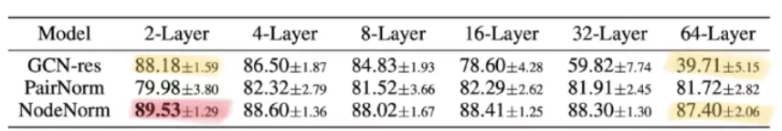
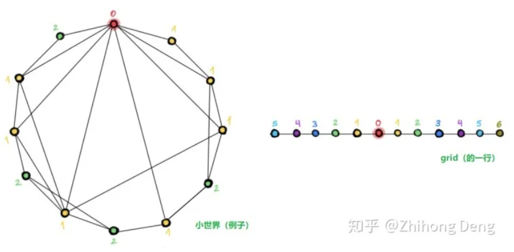
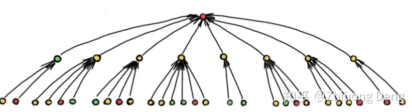
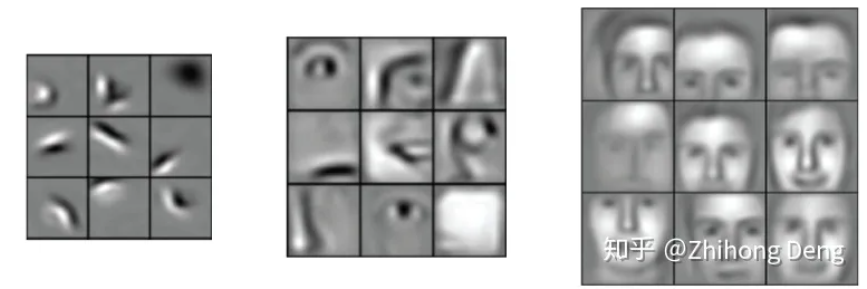

<!-- TOC -->

- [1. 深层图神经网络](#1-深层图神经网络)
  - [1.1. 图的结构](#11-图的结构)
  - [1.2. 短程与远程信息](#12-短程与远程信息)
  - [1.3. 理论局限](#13-理论局限)
  - [1.4. 深度 vs. 丰富度](#14-深度-vs-丰富度)
  - [1.5. 评估](#15-评估)

<!-- /TOC -->

# 1. 深层图神经网络
训练深度图神经网络的难题，除了深度学习的传统问题(**梯度消失和过拟合**)之外，针对于图本身，还需要解决的两个问题：
1. **过渡平滑**：使用多个卷积层后，结点特征趋向于**收敛到相同或相似的向量**，这使它们变得难以区分[1][2][3]
2. **过度压缩**：在使用多层图网络后，邻居数量指数级增长，要将**大量的结点信息压缩到一个结点上就会存在过度压缩的问题**，这也称为瓶颈现象[4]。

上表展示了几种尝试解决深度问题的方法，包括残差连接和两种归一化技术。可以看出随着网络层级加深，GCN-res 效果急剧变差。PairNorm 相对稳定，但降低了性能。NodeNorm 效果最佳，但它的最佳效果是在两层图网络时取得的。这个实验告诉我们，要将深度图网络带来的提升和训练它所需要的技巧分开讨论是很难的。
为什么深度模型在 CV 领域这么好使，但用在图网络上就这么难呢？作者给出了几个观点：

## 1.1. 图的结构
现有工作告诉我们，在分子图、点云和网格（**图像也可以看作是一种网格状的图**）上使用深度图网络是有效的，这些图跟我们常用以评估图神经网络效果的引用网络（例如：Cora、PubMed 或 CoauthorCS）等有何不同呢？下图就给出一个很清晰的示例：

我们常用的引用网络这一类图往往属于直径较小的小世界网络（https://en.wikipedia.org/wiki/Small-world_network），简单点讲就是图中任意两个结点的距离都比较近，几跳就能到达，**使用更深的网络架构并不会扩大感受野**；

相比之下，在**网格（比如图像）这一类图中**，增加层数能让感受野成倍增长，从而更好地捕捉到上下文。使用不同颜色标注不同层数所能到达的结点，可以看到，同样是12个结点的图，左图仅用两种颜色就够了，右图则用了6种颜色。

## 1.2. 短程与远程信息
根据问题的特性，有的问题则可以通过短距离的信息解决，比如社交网络中，预测往往仅依赖于结点的局部邻居；有的问题可能需要更长距离的信息，比如分子图种分子的化学性质可能取决于另一侧的原子组合，这就需要深度图网络来组合这些远程信息。但是随着层数增多，如果图结构会引起结点感受野的指数级增长，那么瓶颈现象就会阻止远程信息的有效传播：

上图就展示了一个例子，在使用深度图网络时，我们需要**把多个结点的信息整合到一个结点中**并迭代此过程，所以传播过程中可能会丢失不少有用的信息，也就解释了为什么深度模型难以提高性能。

## 1.3. 理论局限
我们在使用深度神经网络的时候，往往可以做一些可视化分析，比如 CNN 可以将每一层学到的特征做一个可视化：

浅层神经元学到是比较简单的特征，比如某些纹理、线条；深层神经元学到的则是更复杂的一些特征，比如眼睛，鼻子等等。但是，图神经网络里也能这么分析吗？多层的图网络也能学到逐渐复杂的性质吗？我们目前尚不清楚哪些图形性质可以用浅层图网络学到，哪些需要更深的网络，哪些是根本无法计算的。

## 1.4. 深度 vs. 丰富度

在 CV 中，因为所有图像都是**非常规则的网格结构**，所以结构就变得不再重要的，但在图深度学习中，结构是很重要的，如何设计更复杂的，可以处理高阶信息（比如：各种motif）的消息传递机制仍有待探索。目前大家主要关注的还是1-跳卷积，但我们可以设计出多跳的filter，比如 SIGN（https://towardsdatascience.com/simple-scalable-graph-neural-networks-7eb04f366d07） 这篇论文。有趣的是，这跟 CV 领域的发展历程恰恰相反，CV 领域早期的浅层模型一般使用的是大型 filter（比如：11×11），后来逐渐发展到使用小型 filter（比如 ：3×3）的深度模型。这里作者想表达的“丰富度”的意思应该是指，我们是不是也能像 CV 里 GoogLeNet 那样使用Inception模块，同时使用1-跳卷积，2-跳卷积等多种 filter（对应 CV 里的 3×3、5×5 等等），这其实也会间接地帮助到信息的有效传播。

## 1.5. 评估
最后但或许也很重要的一点就是评估方法，一些常见的基准数据集和方法未必能准确评估图神经网络的效果，我们观察到深度图网络在一些数据集上性能随深度下降，或许仅仅是因为数据集太小，发生了过拟合。斯坦福新推出的 Open Graph Benchmark（https://ogb.stanford.edu/） 可以解决部分问题，它提供了大规模的图数据，并给定了训练和测试数据的划分方式。

[1] More precisely, over-smoothing makes node feature vector collapse into a subspace, see K. Oono and T. Suzuki, Graph neural networks exponentially loose expressive power for node classification (2019). arXiv:1905.10947, which provides asymptotic analysis using dynamic systems formalist.
[2] Q. Li, Z. Han, X.-M. Wu, Deeper insights into graph convolutional networks for semi-supervised learning (2019). Proc. AAAI. Draws the analogy between the GCN model and Laplacian smoothing and points to the over-smoothing phenomenon.
[3] H. Nt and T. Maehara, Revisiting graph neural networks: All we have is low-pass filters (2019). arXiv:1905.09550. Uses spectral analysis on graphs to answer when GCNs perform well.
[4] U. Alon and E. Yahav, On the bottleneck of graph neural networks and its practical implications (2020). arXiv:2006.05205. Identified the over-squashing phenomenon in graph neural networks, which is similar to one observed in sequential recurrent models.