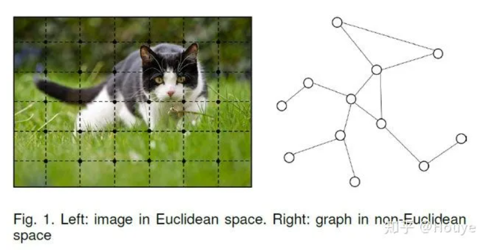

# 1 历史脉络
1. 图神经网络的概念最早在2005年提出。2009年Franco博士在其论文 [2]中定义了图神经网络的理论基础，笔者呆会要讲的第一种图神经网络也是基于这篇论文。
2. 最早的GNN主要解决的还是如分子结构分类等严格意义上的图论问题。但实际上**欧式空间**(比如像图像 Image)或者是**序列**(比如像文本 Text)，许多常见场景也都可以转换成图(Graph)，然后就能使用图神经网络技术来建模。
3. 2009年后图神经网络也陆续有一些相关研究，但没有太大波澜。直到2013年，在图信号处理(Graph Signal Processing)的基础上，Bruna(这位是LeCun的学生)在文献 [3]中首次提出图上的基于**频域(Spectral-domain)**和基于**空域(Spatial-domain)的卷积神经网络**。
4. 其后至今，学界提出了很多基于空域的图卷积方式，也有不少学者试图通过统一的框架将前人的工作统一起来。而基于频域的工作相对较少，只受到部分学者的青睐。
5. 值得一提的是，图神经网络与图表示学习(Represent Learning for Graph)的发展历程也惊人地相似。2014年，在word2vec [4]的启发下，Perozzi等人提出了DeepWalk [5]，开启了深度学习时代图表示学习的大门。更有趣的是，就在几乎一样的时间，Bordes等人提出了大名鼎鼎的TransE [6]，为知识图谱的分布式表示(Represent Learning for Knowledge Graph)奠定了基础。

# 2. 图神经网络
首先要澄清一点，除非特别指明，本文中所提到的图均指图论中的图(Graph)。它是一种由若干个结点(Node)及连接两个结点的边(Edge)所构成的图形，用于刻画不同结点之间的关系。下面是一个生动的例子，图片来自论文[7]:

## 2.1 状态更新与输出
最早的图神经网络起源于Franco博士的论文[2], 它的理论基础是**不动点**理论。给定一张图 $G$,每个节点都有其自己的特征(feature)，本文中用 $X_v$来表示节点v的特征；连接两个节点的边也有自己的特征，本文中用$X_{(v,u)}$

