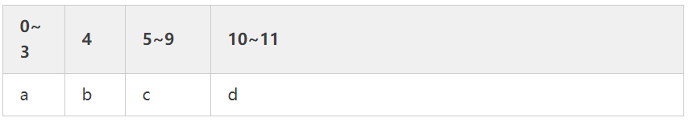

# 1 字节对齐
> 什么是字节对齐？

计算机内存大小的基本单位是字节，理论上讲，可以从任意地址访问某种基本数据类型，但是实际上，计算机并非逐字节大小读写内存，而是以2,4,或8的 倍数的字节块来读写内存，如此一来就会对基本数据类型的合法地址作出一些限制，即它的地址必须是2，4或8的倍数。那么就要求各种数据类型按照一定的规则在空间上排列，这就是对齐。

> 对齐准则是什么

总的来说，字节对齐有以下准则：
* 结构体变量的首地址能够被其对齐字节数大小所整除。
* 结构体每个成员相对结构体首地址的偏移都是成员大小的整数倍，如不满足，对前一个成员填充字节以满足。
* 结构体的总大小为结构体对最大成员大小的整数倍，如不满足，最后填充字节以满足。

我们通过一个例子来说明如何对齐的。
```cpp
#include<stdio.h>
#include<stdint.h>
struct test
{
    int a;  // 4
    char b; // 1
    int c;  // 4
    short d;    // 2
};
int main(int argc,char *argv)
{
    /*在32位和64位的机器上，size_t的大小不同*/
    printf("the size of struct test is %zu\n",sizeof(struct test));
    return 0;
}
```

编译成32位程序并运行（默认四字节自然对齐），可以看到，结构体test 的大小为16字节，而不是11字节（a占4字节，b占1字节，c占4字节，d占2字节）

实际上，结构体test的成员在内存中可能是像下面这样分布的（数值为偏移量）

未对齐时：


对齐时:


> 为何要字节对齐

无论数据是否对齐，大多数计算机还是能够正确工作，而且从前面可以看到，结构体test本来只需要11字节的空间，最后却占用了16字节，很明显浪费了空间，那么为什么还要进行字节对齐呢？最重要的考虑是**提高内存系统性能**

前面我们也说到，计算机**每次读写一个字节块**，例如，假设计算机总是从内存中取8个字节，如果一个double数据的地址对齐成8的倍数，那么一个内存操作就可以读或者写，但是如果这个double数据的地址没有对齐，数据就可能被放在两个8字节块中，那么我们可能需要执行两次内存访问，才能读写完成。显然在这样的情况下，是低效的。所以需要字节对齐来提高内存系统性能。

> 实际编程中的考虑

实际上，字节对齐的细节都由编译器来完成，我们不需要特意进行字节的对齐，但并不意味着我们不需要关注字节对齐的问题。

>空间存储

还是考虑前面的结构体test，其占用空间大小为16字节，但是如果我们换一种声明方式，调整变量的顺序，重新运行程序，最后发现结构体test占用大小为12字节
```cpp
struct test
{
    int a;
    char b;
    short d;
    int c;
};
```

空间存储情况如下,b和d存储在了一个字节块中:


也就是说，如果我们在设计结构的时候，合理调整成员的位置，可以**大大节省存储空间。但是需要在空间和可读性之间进行权衡**。  

> 跨平台通信

由于不同平台对齐方式可能不同，如此一来，同样的结构在不同的平台其大小可能不同，在无意识的情况下，互相发送的数据可能出现错乱，甚至引发严重的问题。因此，为了不同处理器之间能够正确的处理消息，我们有两种可选的处理方法。

* 1字节对齐
* 自己对结构进行字节填充

我们可以使用伪指令 **#pragma pack(n)(n为字节对齐数)** 来使得结构间一字节对齐。
同样是前面的程序，如果在结构体test的前面加上伪指令，即如下:

```cpp
#pragma pack(1) /*1字节对齐*/
struct test
{
    int a;
    char b;
    int c;
    short d;
};
#pragma pack()/*还原默认对齐*/
```

在这样的声明下，任何平台结构体test的大小都为11字节，这样做能够保证跨平台的结构大小一致，同时还节省了空间，但不幸的是，降低了效率。

当然了对于单个结构体，如下的方法，使其1字节对齐

```cpp
struct test
{
    int a;
    char b;
    int c;
    short d;
};__attribute__ ((packed));
```

注：
* __attribute__((aligned (n)))，让所作用的结构成员对齐在n字节自然边界上。如果结构中有成员的长度大于n，则按照最大成员的长度来对齐
* __attribute__ ((packed))，取消结构在编译过程中的优化对齐，也可以认为是1字节对齐。


