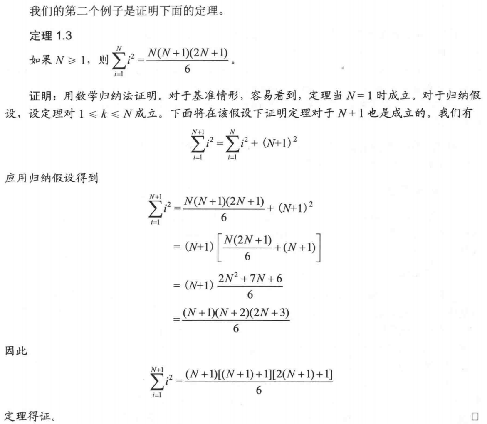
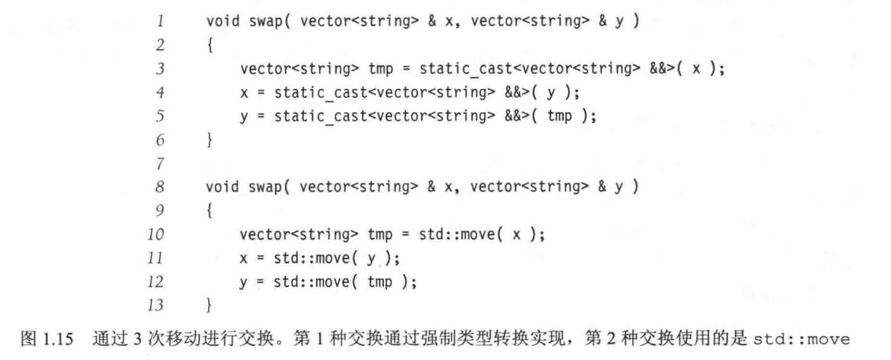

# 算法
## 1 数学知识复习
>指数


>对数


> 级数


> 归纳推理




> 反证法


## 2 c++特性


### 2.1 std::swap 和 std:move
C++中所有的值都必然属于左值，右值两者之一。左值是 **指表达式结束后依然存在的持久化对象**，右值是**指表达式结束时就不再存在的临时对象**。所有的具名
变量都是左值，而右值不具名。区分方法：**看能不能对表达式取地址，如果能，就为左值，否者为右值。**


```c++
void swap(double & x,double &y){
    cout<<" x: "<<&x<<" y: "<<&y<<endl;
    double tmp=x;
    cout<<" x: "<<&x<<" y: "<<&y<<" tmp: "<<&tmp<<" x: "<<x<<" y: "<<y<<endl;
    x=y;
    cout<<" x: "<<&x<<" y: "<<&y<<" tmp: "<<&tmp<<" x: "<<x<<" y: "<<y<<endl;
    y=tmp;
    cout<<" x: "<<&x<<" y: "<<&y<<" tmp: "<<&tmp<<" x: "<<x<<" y: "<<y<<endl;
}

 a: 0x7fffac86fff8 b: 0x7fffac870000 a: 10.5 b: 2.2
 x: 0x7fffac86fff8 y: 0x7fffac870000
 x: 0x7fffac86fff8 y: 0x7fffac870000 tmp: 0x7fffac86ffa0 x: 10.5 y: 2.2
 x: 0x7fffac86fff8 y: 0x7fffac870000 tmp: 0x7fffac86ffa0 x: 2.2 y: 2.2
 x: 0x7fffac86fff8 y: 0x7fffac870000 tmp: 0x7fffac86ffa0 x: 2.2 y: 10.5
 a: 0x7fffac86fff8 b: 0x7fffac870000 a: 2.2 b: 10.5
```



```c++
void swap(vector<string> & x,vector<string> &y){
    vector<string>  tmp= static_cast<vector<string> && > (x);
    cout<<" x: "<<&x<<" y: "<<&y<<" tmp: "<<&tmp<<endl;
    //这里的x被右值引用后已经为空了，无法输出打印
    cout<<" y: "<<&y<<" y: "<<y[0]<<y[1]<<" tmp: "<<tmp[0]<<tmp[1]<<endl;
    //cout<<" x: "<<&x<<" y: "<<&y<<" x: "<<x[0]<<x[1]<<" y: "<<y[0]<<y[1]<<" tmp: "<<tmp[0]<<tmp[1]<<endl;
    x = static_cast<vector<string> && >(y);
    cout<<" x: "<<&x<<" y: "<<&y<<" tmp: "<<&tmp<<endl;
    y = static_cast<vector<string> && >(tmp);
    cout<<" x: "<<&x<<" y: "<<&y<<" tmp: "<<&tmp<<endl;
}


int main(int argc,char** argv) {
    string str[]={"wf1"," wf2"};
    vector<string> a(str,str+2);
    string str2[]={"xz1"," xz2"};
    vector<string> b(str2,str2+2);
    cout<<" a: "<<&a<<" b: "<<&b<<" a: "<<a[0]<<a[1]<<" b: "<<b[0]<<b[1]<<endl;
    swap(a,b);
    cout<<" a: "<<&a<<" b: "<<&b<<" a: "<<a[0]<<a[1]<<" b: "<<b[0]<<b[1]<<endl;
    cout<<"endl"<<endl;
    return 0;
}
```

### 2.2 五大类函数


```c++
using namespace std;

class InteCell{
private:
    int *storedValue;
public:
    explicit InteCell(int initialValue=0){
        storedValue = new int{initialValue};
    }

    int read() const{
        return *storedValue;
    }
    void write(int x){
        *storedValue = x;
    }
};

int main(int argc,char** argv){
    InteCell a(2);
    InteCell b=a;
    InteCell c;

    c=b;
    a.write(4);
    cout<<a.read()<<endl<<b.read()<<endl<<c.read()<<endl;
    return 0;
}


输出结果：4 4 4 
```


```c++
class InteCell{
private:
    int *storedValue;
public:
    explicit InteCell(int initialValue=0){
        storedValue = new int{initialValue};
    }

    ~InteCell(){                //析构函数
        delete storedValue;
    }

    InteCell(const InteCell &rhs){  //拷贝构造函数
        storedValue=new int {*rhs.storedValue};
    }

    InteCell(InteCell && rhs)    noexcept :storedValue{rhs.storedValue}{     //移动构造函数
        rhs.storedValue = nullptr;
    }

    InteCell & operator= (const InteCell & rhs){        //拷贝赋值
        if(this != &rhs)    //检测 自我赋值，客户端调用 obj=obj的
            *storedValue = *rhs.storedValue;
        else
            cout<<"Don't use obj=obj"<<endl;
        return *this;   //结束时，返回对自己的引用
    }

    InteCell & operator- (InteCell && rhs){             //移动赋值
        std::swap(storedValue,rhs.storedValue);
        return *this;
    }

    int read() const{
        return *storedValue;
    }
    void write(int x){
        *storedValue = x;
    }
};

输出结果： 4 2  2 
```

### 2.3 函数模板


### 2.4 类模板

假设Object有一个零参数构造函数、一个拷贝构造函数和一个拷贝赋值运算符，MemoryCell虽然象 IntCell 类，但是却为任何类型的Object工作。
```c++
/*
 * 一个模拟内存单元的类
 */

template <typename Object>
class MemoryCell{
private:
    Object storedValue; //storedValue可能是某个类型，int,vector或 IntCell
public:
    //构造函数的默认参数不是0.因为0不可能是一个合理的Object对象。
    //默认参数是使用零参数构造函数构造一个 object对象所得到的结果。
    explicit MemoryCell(const Object & initialValue = Object{})
    :storedValue{initialValue} {
    }

    const Object & read() const {
        return storedValue;
    }

    void write(const Object & x){
        storedValue = x;
    }

};
```

### 2.5 函数对象
```c++
/*泛型 findMax,带有一个函数对象，
 *前提： a.size()>0*/

template <typename Object,typename Comparator>
const Object & findMax(const vector<Object> & arr, Comparator cmp){
    int maxIndex = 0;

    for(int i=1;i<arr.size();++i)
        if(cmp.isLessThan(arr[maxIndex],arr[i]))
            maxIndex = i;
    return arr[maxIndex];

}

class CaseInsensitiveCompar{
public:
            bool isLessThan(const string &lhs,const string & rhs) const{
                return strcasecmp(lhs.c_str(),rhs.c_str()) < 0;
            }
        };

int main(int argc,char** argv){
    vector<string> arr = {"ZEBRA","alligator","crocodile"};
    cout<<findMax(arr,CaseInsensitiveCompar{})<<endl;
    return 0;
}
```
可以使用 operator(),cmp.operator()(x,y)可以简写成 cmp(x,y)，换句话说，它看起来像是函数调用，因而operator()被称为 **函数调用操作符**。结果，函数名可以改为更有意义的 isLessThan,而调用则是 isLessThan(x,y)。
```c++
#include <iostream>
#include <vector>
#include "IntCell.h"
#include "string"
#include "strings.h"

using namespace std;

/*泛型 findMax,带有一个函数对象，
 *前提： a.size()>0*/

template <typename Object,typename Comparator>
const Object & findMax(const vector<Object> & arr, Comparator isLessThan){
    int maxIndex = 0;

    for(int i=1;i<arr.size();++i)
        if(isLessThan(arr[maxIndex],arr[i]))
            maxIndex = i;
    return arr[maxIndex];

}

class CaseInsensitiveCompar{
public:
            bool operator() (const string &lhs,const string & rhs) const{
                return strcasecmp(lhs.c_str(),rhs.c_str()) < 0;
            }
        };

int main(int argc,char** argv){
    vector<string> arr = {"ZEBRA","alligator","crocodile"};
    cout<<findMax(arr,CaseInsensitiveCompar{})<<endl;
    return 0;
}
```

### 2.6 矩阵

一个完整的matrix类
```c++
template <typename Object>
class matrix{
private: vector<vector<Object>> array;
public:
    matrix(int rows, int cols):array(rows){
        for(auto & thisRow: array)
            thisRow.resize(cols);
    }

    matrix(vector<vector<Object>> v) :array{v}{

    }
    matrix(vector<vector<Object>> && v): array{std::move(v)}{   //移动构造函数

    }

    const vector<Object> & operator[] (int row) const{  //常成员函数，
        return array[row];
    }
    vector<Object> & operator[] (int row){
        return array[row];
    }

    int numrows() const {
        return array.size();
    }
    int numcols() const {
        return numrows() ? array[0].size():0;
    }
};
```
## 3 算法分析
### 3.1 一般法则


### 3.2 最大相连子序列和问题
```c++
/*
 * 最大相连子序列和的立方级算法*/
int maxSubSml(const vector<int>& a){
    int maxSum=0;

    for(int i=0;i<a.size();++i)
        for(int j=i;j<a.size();++j)
        {
            int thisSum=0;

            for(int k=i;k<=j;++k)
                thisSum += a[k];

            if(thisSum > maxSum)
                maxSum = thisSum;
        }
    return maxSum;
}
//TIme: 0.002994s
```

```c++
/*
 * 平方级算法*/
int maxSubSml2(const vector<int> &a){
    int maxSum = 0;

    for(int i=0;i<a.size();++i) {
        int thisSum = 0;
        for (int j = i; j < a.size(); ++j) {
            thisSum += a[j];
            if (thisSum > maxSum)
                maxSum = thisSum;
        }
    }
    return maxSum;
}
//TIme: 0.000127s
```


```c++
/*相连最大子序列的递归算法
 * 找出生成[left...right]的子数组中最大和。
 * 不试图保留具体的最佳序列
 * 复杂度： O(NlogN)*/
int maxSumRec(const vector<int> & a, int left, int right){
    if(left==right)  // 基准情况
    {
        return a[left];
    }
    int center = (left+right)/2;
    int maxLeftSum = maxSumRec(a,left,center);
    int maxRightSum = maxSumRec(a,center+1,right);

    int maxLeftBorderSum=0,leftBorderSum=0;
    for(int i=center;i>=left;--i){
        leftBorderSum += a[i];
        if(maxLeftBorderSum<leftBorderSum)
            maxLeftBorderSum = leftBorderSum;
    }

    int maxRightBorderSum=0,rightBorderSum=0;
    for(int j=center;j<=right;++j){
        rightBorderSum=a[j];
        if(maxRightBorderSum<rightBorderSum)
            maxRightBorderSum = rightBorderSum;
    }

    return max3(maxLeftSum,maxRightSum,maxLeftBorderSum+maxLeftBorderSum);
}


int main(int argc,char** argv){
    clock_t startTime,endTime;
    startTime = clock();
    vector<int> arr{1,4,-3,5,6,-5,6,7,-9,10,1,4,-3,5,6,-5,6,7,-9,10,1,4,-3,5,6,-5,6,7,-9,10,1,4,-3,5,6,-5,6,7,-9,10,
                    1,4,-3,5,6,-5,6,7,-9,10,1,4,-3,5,6,-5,6,7,-9,10,1,4,-3,5,6,-5,6,7,-9,10,1,4,-3,5,6,-5,6,7,-9,10,
                    1,4,-3,5,6,-5,6,7,-9,10,1,4,-3,5,6,-5,6,7,-9,10,1,4,-3,5,6,-5,6,7,-9,10,1,4,-3,5,6,-5,6,7,-9,10,
                    1,4,-3,5,6,-5,6,7,-9,10,1,4,-3,5,6,-5,6,7,-9,10,1,4,-3,5,6,-5,6,7,-9,10,1,4,-3,5,6,-5,6,7,-9,10};
    cout<< maxSumRec(arr,0,arr.size()-1)<<endl;
    //cout<< maxSubSml2(arr)<<endl;

    endTime=clock();
    cout << "The run time is: " <<(double)(endTime - startTime) / CLOCKS_PER_SEC << "s" << endl;
}


//Time: 3.5e-05s
```


### 3.3 折半查找
```c++
/*每次循环使用两次比较以执行标准的折半查找。
 * 找到时返回所求项的下标，找不到则返回 -1 */
template <typename Comparable>
int binarySearch(const vector<Comparable> & a, const Comparable &x){
   int low=0,high = a.size()-1;
   while (low<=high) {
       int mid = (low + high) / 2;
       if (a[mid] < x)
           low = mid + 1;
       else if (a[mid] > x)
           high = mid - 1;
       else
           return mid;
   }
   return NOT_FOUND;
}
```

```c++
/*欧几里得算法
 * 求两个整数的最大公因数，如 gcd(50,15)=5*/
long long gcd(long long m,long long n){
    while(n!=0){
        long long rem = m%n;
        m=n;
        n=rem;
    }
    return m;
}
 
```
## 4 树
### 4.8 标准库中容器set和map


