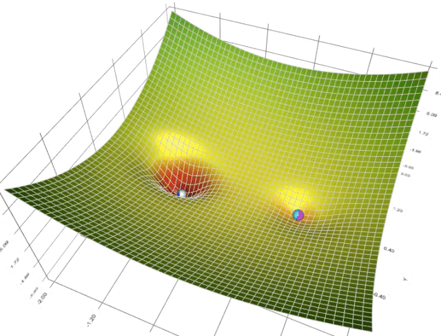
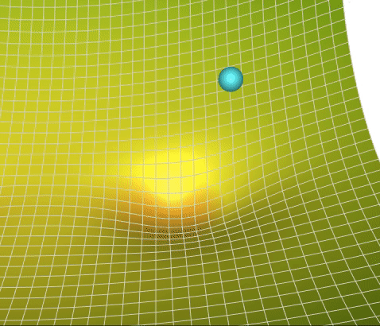
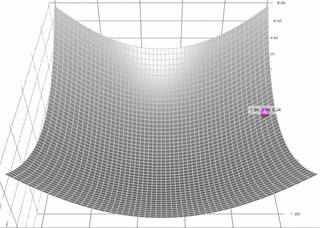
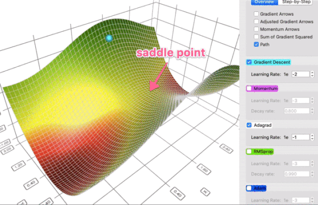
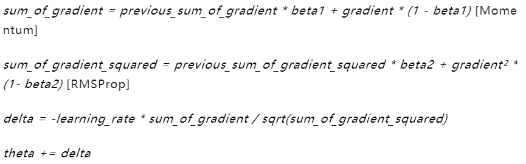

> https://github.com/lilipads/gradient_descent_viz

# 1 Adam, AdaGrad, Momentum, RMSProp的梯度下降可视化解释

梯度下降(青色),momentum(洋红色),AdaGrad(白色),RMSProp(绿色),Adam(蓝色)。左坑是全局极小值，

## 1.2 原始版本梯度下降(Vanilla Gradient Descent)

对于每个参数 $\theta$,做的操作如下
$$
delta = -learning\_rate * gradient
$$

$$
\theta += delta
$$

$\theta$是一些需要优化的参数。

## 1.1 动量(Momentum)

带有动量的梯度下降算法(简称动量)借鉴了物理学的思想。想象一下在无摩擦的碗里滚动一个球。没有在底部停止，而是积累的动量推动它前进，球继续前后滚动。

我们还可以把动量的概念应用到我们的原版梯度下降算法中，在数学上，表示为:
$$
delta = -learning\_rate * gradient + previous\_delta * decat\_rate
$$

$$
\theta += delta
$$

稍微修改一下方程：

$$
sum\_of\_gradient = gradient + previous\_sum\_of\_gradient* decay\_rate
$$

$$
delta = -learning\_rate * sum\_of\_gradient
$$

$$
\theta += delta
$$

让我们考虑两个极端情况来更好地理解这个 衰减率(decay rate)参数，如果衰减率率为0，那么它与原版梯度完全相同。如果衰减率为1，那么就会像我们开始提到的无摩擦的类比一样，前后不断摇摆；你不会想要这样的结果。通常衰减选择在 0.8-0.9左右，他就像一个有一点摩擦的表面，所以它最终会减慢并停止。

那么，在哪些方面动量比原版梯度下降更好呢？在上面的比较中，可以看到两个优点：
1. 动量移动的更快(因为它累积的所有动量)
2. 动量有机会逃脱局部极小值(因为动量可能推动它脱离局部极小值)。同样，我们将在后面看到，它也将更好地通过高原区

## 1.3 AdaGrad

Adaptive Gradient算法，简称 AdaGrad,不是象动量一样跟踪梯度之和，而是**跟踪梯度平方之和**，并使用这种方法在**不同方向上调整梯度**。这些方程通常用张量表示。我将避免使用张量来简化这里的语言。对于**每个维度**：

$$
sum\_of\_gradient\_squared = previous\_sum\_of\_gradient\_squared + gradient^2
$$

$$
delta = -learning\_rate * gradient / sqrt(sum\_of\_gradient\_squard)
$$

$$
\theta += delta
$$

在机器学习优化中，一些特征是非常稀疏的。稀疏特征的平均梯度通常很小，所以这些特征的训练速度要慢得多。解决这个问题的一种方法是为每个特征设置不同的学习率，但这很快就会变得混乱。

Adagrad解决这个问题的思路是：你已经更新的特征越多，你将来更新的就越少，这样就会有机会让其他特征(列如稀疏特征)赶上来，用可视化的术语来说，更新这个特征的程度即在这个维度中移动了多少，这个概念由**梯度平方的累计和表示**。

这个属性让 AdaGrad(以及其他类似的基于梯度平方的方法，如 RMSProp 和 Adam)更好地避开鞍点。Adagrad将采取直线路径，而梯度下降(或相关动量)采取的方法是"让我先滑下陡峭的斜坡，然后才可能担心较慢的方向"。有时候，原版的梯度下降可能非常满足仅仅停留在鞍点，那里两个方向的梯度都是0.

## 1.4 RMSProp
然而， AdaGrad的问题在于它非常慢，这是因为梯度的平方和只会增加而不会减小，RMsProp(Root Mean Square Propogation)通过添加衰减因子来修复这个问题。

$$
sum\_of\_gradient\_squared = previous\_sun\_of\_gradient\_squared* decay\_date + gradient ^ 2 * (1-decay\_rate)
$$

$$
delta = -learning\_rate * gradient / sqrt(sum\_of\_gradient\_squared)
$$

$$
theta += delta
$$

更精确的说，梯度的平方和实际上是梯度平方的衰减和。衰减率表明的是只是最近的梯度平方有意义，而很久以前的梯度基本上会被遗忘。这个和动量中看到的衰减率不同，除了衰减之外，这里的衰减率还有一个缩放效应：它以一个因子（1-衰减率）向下缩放整个项，如果衰减率设置为0.99，除了衰减之外，梯度的平方和将是 sqrt(1-0.99) = 0.1 ,因此相对于相同的学习率，这一步放大了10倍。

为了看到衰减的效果，在这个对比中，AdaGrad(白色)最初和RMSProp(绿色)差不多，正如调整学习率和衰减率的预期。但是 AdaGrad的梯度平方和累计得非常快，以至于它们很快就会百年的非常巨大(从动物方块得大小可以看出)，最终 Adagrad几乎停止。另一方面，由于衰变率的原因，RMSProp一直将方块保持在一个可控的大小，这使得RMSProp比 AdaGrad更快。

## 1.5 Adam
最后但并非最不重要的是，Adam (Adaptive Moment Estimation)同时兼顾了动量和 RMSProp 的优点。Adam在实践中效果很好，因此在最近几年，它是深度学习问题的常用选择。
让我们来看看它是如何工作的:

Beta1 是一阶矩梯度之和和(动量之和)的衰减率，通常设置为0.9.Beta2是二阶梯度平方和的衰减率，通常设置为 0.999

Adam 的速度来自于动量和RMSProp 适应不同方向的梯度的能力。这两者的结合使它变得更强大。

总之，梯度下降法算法是一类通过梯度来寻找函数最小点的算法。原版梯度下降只遵循梯度(按学习速率进行调整)。改善梯度下降法的两个常用工具是**梯度之和(一阶矩)**和**梯度平方之和(二阶矩)**。动量利用**一阶矩**的衰减率来获得**速度**。Adagrad 使用**没有衰减的二阶矩**来处理**稀疏特征**。Rmsprop 使用**二阶矩的衰减率**来加速 AdaGrad。Adam同时使用一阶矩和二阶矩，通常是最好的选择。还有一些其它的梯度下降算法，比如 Nesterov 加速梯度算法，AdaDelta 算法等等，在本文中没有涉及。

