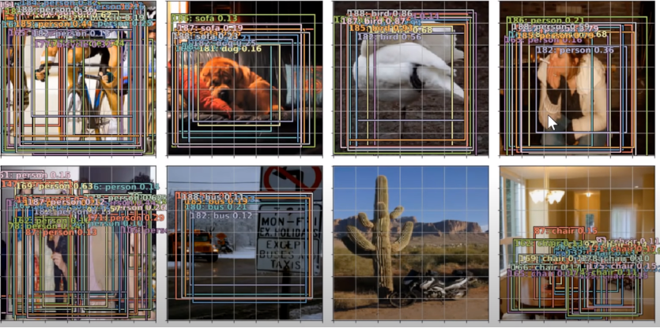
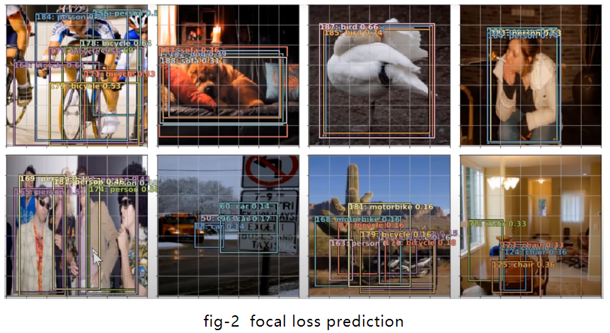
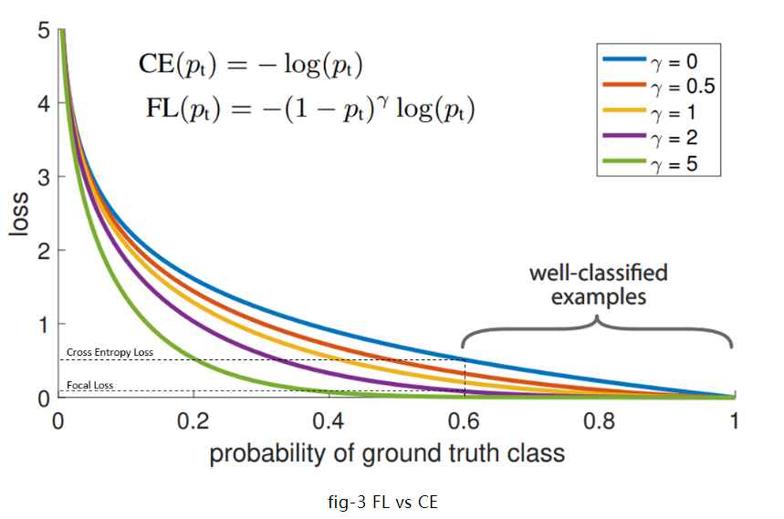
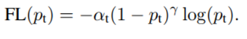
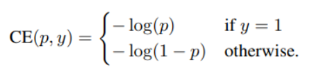
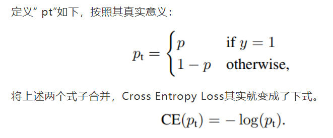
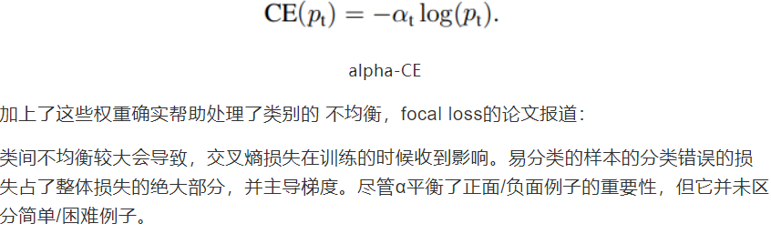
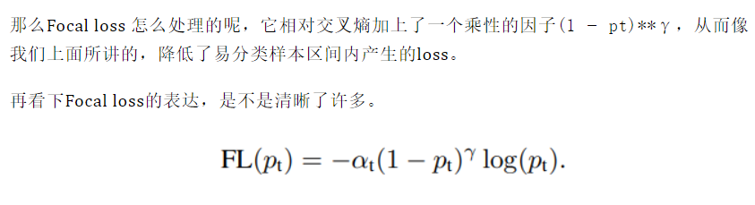

# 1. YOLO系列

## 1.1 Focal loss

### 1 什么是 Focal loss,他是用来干嘛的？
Focal loss 最早是在He et al在论文 《Focal Loss for Dense Object Detection》实现的。

在这篇文章发表之前，对象检测实际上一直被认为是一个很难解决的问题，尤其是很难检测图像中的小尺寸对象。请参见下面的示例，与其他图片相比，摩托车的尺寸相对较小， 所以该模型无法很好地预测摩托车的存在。



在上图中，模型无法预测摩托车的原因是因为该模型是使用了 Binary Cross Entropy loss，这种训练目标要求模型对对自己的预测真的很有信心。而Focal Loss所做的是，它使模型可以更"放松"地预测事物，而无需80-100％确信此对象是“某物”。简而言之，它给模型提供了更多的自由，可以在进行预测时承担一些风险。这在处理高度不平衡的数据集时尤其重要，因为在某些情况下（例如癌症检测），即使预测结果为假阳性也可接受，确实需要模型承担风险并尽量进行预测。

因此，Focal loss在样本不平衡的情况下特别有用。特别是在“对象检测”的情况下，大多数像素通常都是背景，图像中只有很少数的像素具有我们感兴趣的对象。

这是经过Focal loss训练后同一模型对同样图片的预测。



分析这两者并观察其中的差异，可能是个很好的主意。这将有助于我们对于Focal loss进行直观的了解。

### 2 那么为什么Focal loss有效，其中的原理是什么？

既然我们已经看到了“Focal loss”可以做什么的一个例子，接下来让我们尝试去理解为什么它可以起作用。下面是了解Focal loss的最重要的一张图：



在上图中，“蓝”线代表交叉熵损失。X轴即“预测为真实标签的概率”（为简单起见，将其称为pt）。举例来说，假设模型预测某物是自行车的概率为0.6，而它确实是自行车， 在这种情况下的pt为0.6。而如果同样的情况下对象不是自行车。则pt为0.4，因为此处的真实标签是0，而对象不是自行车的概率为0.4（1-0.6）。

Y轴是给定pt后Focal loss和CE的loss的值。

从图像中可以看出，当模型预测为真实标签的概率为0.6左右时，交叉熵损失仍在0.5左右。因此，为了在训练过程中减少损失，我们的模型将必须以更高的概率来预测到真实标签。换句话说，交叉熵损失要求模型对自己的预测非常有信心。但这也同样会给模型表现带来负面影响。

深度学习模型会变得过度自信, 因此模型的泛化能力会下降.

这个模型过度自信的问题同样在另一篇出色的论文 Beyond temperature scaling: Obtaining well-calibrated multiclass probabilities with Dirichlet calibration 被强调过。

另外，作为重新思考计算机视觉的初始架构的一部分而引入的标签平滑是解决该问题的另一种方法。

Focal loss与上述解决方案不同。从比较Focal loss与CrossEntropy的图表可以看出，当使用γ> 1的Focal Loss可以减少“分类得好的样本”或者说“模型预测正确概率大”的样本的训练损失，而对于“难以分类的示例”，比如预测概率小于0.5的，则不会减小太多损失。因此，在数据类别不平衡的情况下，会让模型的注意力放在稀少的类别上，因为这些类别的样本见过的少，比较难分。

Focal loss的数学定义如下：



### 3 Alpha and Gamma?

那么在Focal loss 中的alpha和gamma是什么呢？我们会将alpha记为α，gamma记为γ。

我们可以这样来理解fig3

γ 控制曲线的形状. γ的值越大, 好分类样本的loss就越小, 我们就可以把模型的注意力投向那些难分类的样本. 一个大的 γ 让获得小loss的样本范围扩大了.

同时，当γ=0时，这个表达式就退化成了Cross Entropy Loss，众所周知地






现在我们知道了γ的作用，那么α是干什么的呢？

除了Focal loss以外，另一种处理类别不均衡的方法是引入权重。给稀有类别以高权重，给统治地位的类或普通类以小权重。这些权重我们也可以用α表示。




>尽管我们加上了α, 它也确实对不同的类别加上了不同的权重, 从而平衡了正负样本的重要性 ，但在大多数例子中，只做这个是不够的. 我们同样要做的是减少容易分类的样本分类错误的损失。因为不然的话，这些容易分类的样本就主导了我们的训练.




### 4 代码实现
```python

class WeightedFocalLoss(nn.Module):
    "Non weighted version of Focal Loss"
    def __init__(self, alpha=.25, gamma=2):
        super(WeightedFocalLoss, self).__init__()
        self.alpha = torch.tensor([alpha, 1-alpha]).cuda()
        self.gamma = gamma

    def forward(self, inputs, targets):
        BCE_loss = F.binary_cross_entropy_with_logits(inputs, targets, reduction='none')
        targets = targets.type(torch.long)
        at = self.alpha.gather(0, targets.data.view(-1))
        pt = torch.exp(-BCE_loss)
        F_loss = at*(1-pt)**self.gamma * BCE_loss
        return F_loss.mean()
```


