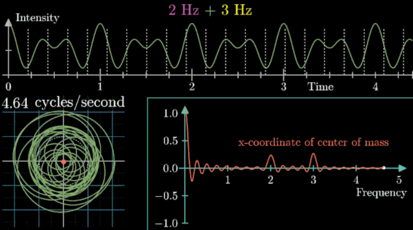
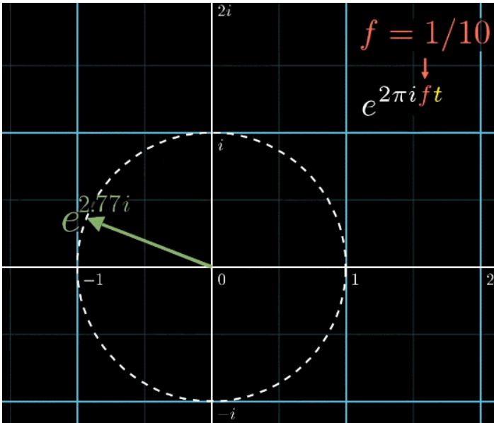
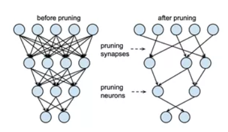

<!-- TOC -->

- [1. 信号处理](#1-信号处理)
  - [1.1. 傅里叶变换](#11-傅里叶变换)
    - [1.1.1. 欧拉公式与旋转](#111-欧拉公式与旋转)
      - [1.1.1.1. 对称性 symmetry](#1111-对称性-symmetry)
    - [1.1.2. 指数函数 Exponentiation](#112-指数函数-exponentiation)
    - [1.1.3. 傅里叶变换](#113-傅里叶变换)
      - [1.1.3.1. [ 声音的表示 ]](#1131--声音的表示-)
      - [1.1.3.2. [ 可视化方法 ]](#1132--可视化方法-)
      - [1.1.3.3. [ 公式表示 ]](#1133--公式表示-)
      - [1.1.3.4. [ 相位 ]](#1134--相位-)
      - [1.1.3.5. [ 原信号的长度 ]](#1135--原信号的长度-)
- [2. 模型压缩](#2-模型压缩)
  - [2.1. 网络剪枝](#21-网络剪枝)

<!-- /TOC -->
# 1. 信号处理
## 1.1. 傅里叶变换
[网址](https://mp.weixin.qq.com/s?__biz=MzU3NDgxMzI0Mw==&mid=2247491368&idx=4&sn=a6a67f166713df337ce067c2fb71f874&chksm=fd2dfa7cca5a736a6b85fe6d7950f057fc62bbe3c2529983fc76b731805870cabc360df7dd59&mpshare=1&scene=24&srcid=1116HWprunPcfcZuY0rADiLt&sharer_sharetime=1605477445693&sharer_shareid=c6dddb77371c457f894e87ca845a013d&key=536a86c14819bea0187e1b46652f83c829b7083346fc8a31277433d3ba971709d0bbadecb21ed8b3fb0c262934e2aa951e1224b7e8922a8a142b64d492489539d9ff6483a23cf704807ca6a7571f41f46d898f177e32c6d8eb55713d7537e4c2fce0b29365837e0b6f1c0596efcbc4ee9758413cb81bd159b071f092f32464ed&ascene=14&uin=MTM2MTEwNTY4NA%3D%3D&devicetype=Windows+10+x64&version=6300002f&lang=zh_CN&exportkey=ARTUQ2WXSRMXqCTWs5VbCZY%3D&pass_ticket=aobu5SAoe%2FctL4ttZsgsRNafU%2BnJRr4WVHzuEQHFa50NhWYJos1NUcOfJWS4z%2FoU&wx_header=0)
### 1.1.1. 欧拉公式与旋转
> **指数函数**(逆操作对数函数同理)是**加法和乘法运算的桥梁**，在自变量**包含复数**时表示**旋转**。

具体的一个例子来说：
> $e^{(\pi i)}$表示的是在单位圆上逆时针旋转180°这个变换。

**欧拉公式**
$$
e^{i \theta} = cos(\theta) + isin\theta
$$
$$
e^{\pi i } + 1= 0, i = \sqrt{-1}
$$

#### 1.1.1.1. 对称性 symmetry
> **正方形**是**对称**图形
>你能对正方形**做些什么**，并且在**这个操作**以后，保持**正方形的形态**和操作前**相同**

有了上面的直观理解，还有一个无限群需要了解，即**旋转群**，表示的是所有旋转操作，当然，因为角度可以无限细分，这个操作也是无限的，比如：顺时针旋转图片$\theta$
此时，能总结出一个巧合的现象，按照顺序进行上面8个操作的某两个，恰好等同于8个操作中的**其他的某一个（旋转群同理）**，如下面的动图所示，把这些组合放到一起，才真正的表达了【群】这个概念

很多不同的概念都能从对称性和对称性的符合构建得到，如下图所示，其中，数字本身有两种表达方式（操作），加法和乘法

对于【数】这个集合来说，加法对应数轴的平移变换（一个操作），乘法对应着数轴的伸缩变换（一个操作）
把这个数轴的概念拓展到**平面坐标系**，1D ➜ 2D。如果我们要把一个点，比如（1,0）**移动到另一个点**，应该如何操作？简单的说，只需要先在**横轴方向**上平移，再在**纵轴方向**上平移即可（核心思想类比于正方形的几个**操作**）
同理，除了**平移**外，使用伸缩加旋转也可以完成同样的事情（将任意一点移动到另一个位置），**伸缩**是**乘法**显而易见，但是**旋转**怎么表示呢？（当然直接**改变坐标轴的定义**也是能做到的，例子就是**极坐标系**，但我们并不想这么做），我们构造以下**思考链条**：
* 考虑一个特例操作：**一个点变到另一个点**：（1,0）通过**伸缩**和**旋转**到（-1,0），长度不用变，只需旋转即可

* 此时，注意到了一个形式很有**特点的定义**： $-1 = i × i$， -1 就是我们需要的目标位置，那如何从（1,0）出发进行**两次同样的操作**可以得到（-1,0）呢？这个操作即 
i这个虚数单位定义的操作）答案即：一个**单位 i**表示**旋转90°**即可

* **更意外的发现**，进行一次 i操作，如果是**逆时针旋转90°**，正好会落在二维平面y轴的（0,1）与**单位长度**不谋而合

* 更大胆的假设，如果y轴自带**虚数单位**，如$i,2i,3i,......$，就有旋转操作了，是不是就就能通过**乘法**来描述处在这个平面上的所有变换了

以上都是假设和推理，剥丝抽茧后，最关键的部分：如何使用单位 i 表示逆时针旋转90° ，并且给出了一种可能的**映射规则**，**x**轴平移表示**伸缩**，**y**轴平移表示**旋转**，这样就可以保证群的特性？（几种操作一定可以组合成其他某个操作，有一个学名：**保持群结构**）

i 怎么可能表示旋转呢？怎么看都像啊，此时陷入了死胡同，不妨换个角度来思考，旋转到底是什么？

**旋转**，是沿着一个圆弧（有圆心，转过的角度）运动的过程

如果你对泰勒公式非常熟悉，就可以通过一系列公式推导得到一个**完美桥梁**：【**指数函数**】，形如 $f(x) = a^x$

如果底数 a=e ，通过泰勒展开式，可以完成一个十分优美的变形，如下：

将 $x=i\theta$带入(1)式中(这里的$\theta$是一个 **未知数**，即 **自变量**)，整理项，移动，结合 $cos(x)$和$sin(x)$的泰勒展开式，还有虚数的$i = -1 * -1$，有一下推导：

这个公式有什么用呢？可视化后，如下图所示

> 假设纵坐标自带虚数单位 i （复平面），那么，sin(θ) 为纵坐标（自带虚数单位 i ），cos(θ) 为横坐标，则可以发现：e^(iθ) 表示一个圆心在原点，半径为1的单位圆（图中是 α ，因为作图软件的限制，换不成 θ ，但不影响）

e^(iθ)这个公式等价于一种旋转，θ为旋转角的度数（统一单位，弧度制，即把°转换成实数）θ=2π 即为360°，是单位圆

我们已经优雅的找到了这个桥梁，接下来仔细研究一下它意味着什么

### 1.1.2. 指数函数 Exponentiation

指数函数有一个非常重要的特性：加法变乘法，即 $a^{x+y} = a^x * a^y$

也就是说通过指数函数，可以做到使用**平移变换**来描述**伸缩变换**，这具体是什么意思呢？参考下面的动图

注意，所谓可以变的意思是说，加法运算可以成立，意味着先往左平移1单位，再往右平移一单位，组合起来的左右就是往右平移一到位（**-1+2=1, 群论的保持结构特性**) ,  而乘法运算成立也要满足这个特性  

复平面 Complex Plane

至此，**构造**复平面，把虚数单位 i加到纵轴上。我们就同时拥有了**伸缩和旋转**，最关键的是，有了这两个操作，我们同时也可以维持的群的特性（使用乘法）

如下面动图所示，在复平面内，以**指数函数为桥梁，实轴横向平移对应伸缩**，**虚轴纵向平移**对应**旋转**

> 横坐标红线，横向平移映射到伸缩操作的可视化 
> 纵坐标虚数单位，纵向平移映射到旋转操作的可视化，正为逆时针旋转

### 1.1.3. 傅里叶变换
傅立叶变换还有很多其他的内容：**离散时间傅立叶变换**，**离散傅立叶变换**，**傅立叶逆变换**，**快速傅立叶变换**等，进一步的**拉普拉斯变换**，**小波变换**，**z变换**等

傅立叶变换，变换作用是时域映射到频域，公式是长这样的

既然是为了【理解】和【记忆】，那么我们还是需要定义一个**联想链条**：
> 傅立叶变换 ➜ 分解声音的过程
#### 1.1.3.1. [ 声音的表示 ]

我们是如何记录声音的呢？如果你测量的是扬声器旁的气压，那么它会是一个随时间以正弦函数形态不断震荡的图像，一个标准音 A（下图黄色），它的频率是440Hz，表示每秒钟振动440次，比它低一些的D（下图紫红），是294Hz，振动的慢一些。如果这两个音同时发出，产生的气压随时间曲线怎么决定呢？如下动图，其实就是把所有时间点的振幅加起来

那么如果给你随意一段随时间变化的气压曲线，你如何找到这些原有的组成音符呢？这就是我们的目的，参考下面的动图，感觉有点像是把一盘混好的原料分成组成它的单独的颜色，感觉不那么容易吧？

#### 1.1.3.2. [ 可视化方法 ]
首先，假设我们有一个每秒钟3拍子的声音信号（440Hz实在太快了），它的图像如下（Intensity为强度，可以同理成气压），并且，我们**只关注前面的4.5秒**（即图像中画出来的部分）
1. **绕圈记录法：同一事物的不同角度**

* 首先把黄色曲线缠绕到一个圆上，大小就是原本信号的振幅
* 圆周围的图像由**白色的箭头**绘制而成，速度可变，上图中的白色箭头移动速度是**每秒钟转过半圈**（这个速度是对于下面的圆形图像来说，每秒钟在圆形图像中转半圈），对应上面的则是**虚线表示一圈**走到的位置，0.5拍子/秒
* 此时，有两个频率在起作用，一个是**信号的频率**：3次震荡/秒，另一个是图像缠绕中心圆的频率，为0.5圈/秒，第二个频率可以自由改变，相当于一个**变量**，下面的动图直观的展现了**缠绕速度变化时的可视化表现**

从最开始的 0.79圈/秒（注意这里的速度是指绕单位圆的白色箭头的滑动速度）一直变化到1.55圈/秒，再到最后的恰好是3圈/秒，和原来的信号3拍/秒相同，此时会出现一个非常稳定的图像，我们可以理解成，同步，这个绕圈图像记录了原信号的幅值变化并且每一圈都相同（周期性）

其实，我们只是把一个水平的轴缠绕到一个单位圆上，并用另一个速度的记录标尺（白色箭头）来画图，从另一个角度（维度）来看我们的信号

2. **质心记录法：新维度的特征提取**

虽然新图像挺好看的，但是现在感觉并没法从中看出什么。也不尽然，我们直观的发现，当白色箭头记录的速度在某些特定的值时，画出来的图形非常稳定，形态清晰。那如何表现这个特征呢？
从两个角度来思考

（1）自变量是什么？（输入特征）
输入是一个**可变化的转圈速度**，既然可变，不妨把它看作自变量，即 f(x)中的x 

2）输出（新的圆圈图）有什么特征？（输出特征）
观察到，当图像很混沌（没有规律，混乱的）时候，图像基本关于原点对称；稳定时，其实是“头重脚轻”的。描述“头重脚轻”最好的方法当然是用【质心】（它描述了物体的空间分布特征） ，下面的动图直观展现了质心特征对图像特征的描述能力（**红色点为质心**）

考虑到质心其实是一个二维坐标，这里为了简洁和直观，取质心的横坐标来表示质心的特征
【输入（横坐标）】➜【进行采样的（白色箭头）的绕圈速度】
【输出（纵坐标）】➜【圆圈图的质心位置的横坐标】

我们可以看到，新图像的横坐标写的是【频率 Frequency】，即缠绕圆圈的记录速度，所以强烈建议看到**频率**，想起**速度**，并且抽象为**围着圆圈跑的速度**（个人感受，对理解【频率】的概念有助益）

好！有了这个工具，先把它应用到两个声音的组合图像中看看效果：（这是我最喜欢的一张动图）

什么？还是没看清上面的振动图像如何变成圆圈图的？看下面的动图，缠绕圆圈速度为2圈/秒的白色箭头将时间信息映射到圆圈图中的的可视化。再次重复，白色箭头以一定的速度（频率，一秒几圈）在上图中向右横移，同时，在下面的单位圆内被转换成类似钟表指针移动的圆圈运动，并记录振幅，画出图像

#### 1.1.3.3. [ 公式表示 ]
大家也发现了，我们已经通过这样一个缠绕机器完成了**时域到频域**的转换，总得来说，参看下面的动图

这是一种【近傅立叶变换】，为什么是【近】，后面会提到。先考虑，那如何数学语言表达这个【转圈记录机制（工具 or 机器）】呢？

**第一步：旋转的表示**

如下面的动图所示，在这个工具中，非常关键的就是**转圈**，即表达旋转这种运动，根据第一大部分，这个桥梁，就是**复平面**，其背后的原理是**指数函数结合泰勒公式**

更进一步，指数函数中，以 
e
e 为底的函数有着特殊的性质，如下面动图所示，
π
π单位的图片就表示一个单位圆的360°旋转，则表示的就是一秒钟一圈的旋转方程，感觉速度有点太快了，所以加一个 f 频率，控制旋转的速度 ，图中为 1/10 , 合起来表示一秒钟**十分之一**圈

**第二步：缠绕的表示**

首先，依据下面的动图所示，在傅立叶变换中，我们**规定旋转是顺时针**的（规定只是为了统一标准，并且有时候也会考虑书写简洁和方便计算），所以**先加一个负号**。假设原来的函数是**g(t)**，将两者的**幅值相乘**就能得到缠绕图像，，可以说是相当机智了！

**第三步：质心的表示**

那如何表示质心这一概念呢？粗略想一下感觉挺难的，但是看起来很难的问题，有一种解决问题的途径是【演绎推理】，先从**简单的特例出发**，推广到**一般**，最后**证明正确性**即可

考虑如何求一个正方形的质心位置，我们只需在边框上取n个**等距离分布的点**，并且算这几个点的位置的平均值。那么推广到一般情况，也使用类似的采样点的方式解决，如下面动图所示（紫红色的点即采样点），得到

随着采样点的增加，需要使用积分来求解这个问题，如下面动图所示，得到

**最终步：整理积分限和系数**

看到常数项系数，如果忽略表达倍数关系的系数，对应的含义也会发生变化，不再是质心，而是信号存在的时间越久，位置是质心位置乘以一个倍数，它的值就越大。参看下面的动图，持续时长为3秒，那么新的位置就是原来质心位置的三倍；为6秒，就是原来的6倍

而去掉系数的几何直观动图变为（红色箭头为去掉系数后的长度表示），最本质的区别是：可以使得最后绘制的图像更集中在对应的频率的附近，或者说在对应的频率位置的值更大

继续考虑上下限。我们知道，一般傅立叶变换公式的上下限是正负无穷，那它的几何直观是什么呢？参看下面动图，其实就是看看信号持续时间无穷大是什么样子的

说实话，这个动图解答了我大学时代的一个疑惑，音乐文件不都是有时间长度的嘛，我就一直不懂，凭什么对负无穷到正无穷做傅立叶变换？原来真实情况是，负无穷到0，音乐结尾到正无穷，就像上面的动图，其实都没有振动幅值（电信号幅值）与之对应，再结合缠绕圆圈的思想：原来，从**音乐开始到结束傅立叶变换**和**从负无穷到正无穷做傅立叶变换**，是特么的一回事啊！（吐槽完毕）

#### 1.1.3.4. [ 相位 ]

在表示质心的时候，我们只取用了x轴坐标，下面的图中的蓝色曲线就是纵坐标（y轴 or 虚部）的可视化,红色曲线是横坐标（x轴 or 实部）

那么相位是如何表示的呢？如下面动图所示，其中红色的部分为质心，长度为振幅大小，对应的角度就是相位

#### 1.1.3.5. [ 原信号的长度 ]

再追根究底一些，因为之前已经提到过，假设我们的信号有4.5s。
那么考虑原信号的长度的变化呢？首先，假设信号的长度很长，那么缠绕圆上的线就会更多，每次接近稳定图像质心的变化速度更快（即频域图像更加密集），参看下面动图

那么对应的，如果原信号的长度缩短呢？如下面动图所示，频域图像会更加稀疏。原因同理，当缠绕的内容少的时候，重心变化的速度也相应的变慢了

总得来说，基本就上述内容就详细解释了下面的现象：

一步一步写出傅立叶变换公式的联想链条

* 一个逆时针旋转360°画成的圆 ➜
* 表示运动，需要原函数的自变量，时间 
* 表示旋转速度，需要自变量，频率 
* 规定变换的采样方向为顺时针，加负号 
* 乘以原函数缠绕到单位圆并记录  此处使用g符号标识原函数是为了和频率符号区分
* 为了计算质心特征，**积分** 
* 自变量为频率 f，写出函数表达式 

# 2. 模型压缩
## 2.1. 网络剪枝
网络剪枝核心思想是发现大型网络中冗余的参数，对大型网络的权重、结构进行剪枝，从而降低过参数量的模型复杂度。
对于网络剪枝的研究早在上个世纪就已经开始，而使网络剪枝变为热门研究领域的是Deep Compression[1]，Deep Compression提出了网络剪枝的常规流程：
1.  预训练好一个待剪枝的网络，得到训练好的模型；
2.  对每个待剪枝的层（全连接层/卷积层）设定权重阈值，对于低于阈值的权重，将其剪枝；
3.  重新训练微调；
4.  若未达到目标参数量，回到2。

该研究中所提出的剪枝方法针对神经网络中神经元之间的连接进行剪枝，是一种**非结构化剪枝**，需要**重新定义存储的数据结构（如CSR/CSC）**，再使用专用硬件进行加速。但对于通用硬件而言，这种方法难以实现加速和存储优化效果。

稀疏正则化和连接剪枝通常会得到一个非结构化的随机连接关系，而不规则的内存访问不利于通用硬件加速，即使稀疏度高达95%，加速效果也十分有限。

Network Slimming[2]则针对通用硬件设计了**结构化剪枝**，这一研究中提出对通道剪枝的方法实现粗粒度剪枝，从而获得更高效的加速。主要方法为利用BN层的缩放因子在训练时进行**L1正则**，在剪枝时则将**缩放因子视为通道重要性得分进行剪枝**。但这一方法仍然存在一些问题：

1.  **BN层的偏移参数**没有引入惩罚项；
2.  没有解决**残差网络中的剪枝通道数目一致性问题**；
3.  **L1正则先验假设过强**；
4.  为了达到目标模型复杂度，需要迭代执行“训练-剪枝”步骤，同时由于剪枝的通道不会再参与下一次训练，训练步骤需要较长时间达到高精度才能进行剪枝，导致剪枝耗时较长。

Gate Decorator[6]加入了对BN层偏移参数的正则处理，同时使用Taylor展开的方法重定义重要性得分，对于残差网络结构，使用了分组的方法维持通道数目一致性。FPGM[7]则认为**通道的重要性是相对的**，指出了L1正则项中先验条件不满足的网络情况，改用修剪几何中心的方法进行通道剪枝。

